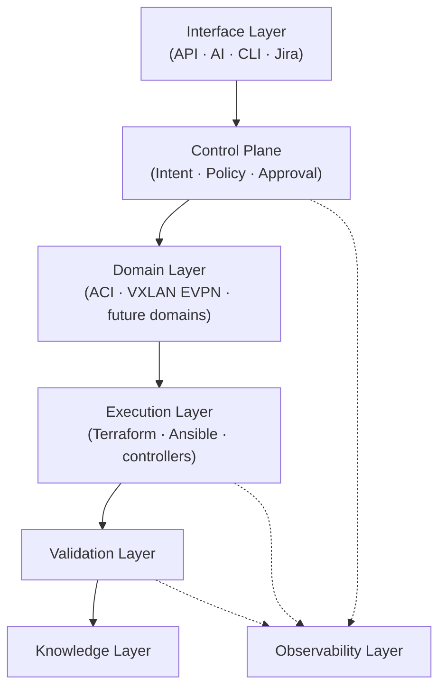

# Platform v1 — Engineering Guide

**Document Type:** Platform Engineering Guide

**Status:** Stable — Pre-Implementation

**Owner:** Platform Engineering Team

**Date:** 2026-07-05

---

# Purpose

This document is the mental model of the platform before execution begins. It is not an ADR, not a specification, not a roadmap, and not an implementation plan — all of those exist elsewhere and remain authoritative for their own detail. This document exists so a senior engineer can understand what the platform is, how it fits together, and why it is shaped this way, without reading any of them first.

**Why this platform exists.** Network infrastructure engineering has traditionally been automated by chaining scripts and playbooks directly against target systems, one tool talking to the next, with no independent record of what was actually intended versus what a script happened to do. That model works until it doesn't: nothing enforces consistency across requests, nothing distinguishes "what we wanted" from "what we ran," and every new automation surface (a new entry point, a new domain, a new tool) has to re-solve governance, validation, and traceability from scratch.

**Why Control Plane architecture replaces traditional automation.** A Control Plane inverts this: engineering requests are first turned into a single, well-defined statement of desired state, independent of how they arrived or how they'll eventually be realized. Everything downstream — policy, approval, execution, validation, history — operates on that one statement. Tools change; the statement's shape does not.

**Why intent-based engineering is the foundation.** Once "what is wanted" is captured as a durable, versioned object instead of implied by a script's side effects, the platform can reason about it: validate it, govern it, defer its execution, retry it, roll it back, or explain it later. None of that is possible when intent only ever exists transiently, inside a running script.

**Why separation of concerns is critical.** The platform makes several deliberate distinctions — intent versus deployment, policy versus approval, desired state versus execution state — because collapsing any of them back together reintroduces the same coupling problems traditional automation has. Each separation below exists because a real design question forced it, not for its own sake.

---

# Key Architectural Mental Model

```text
Engineer / System / AI
        ↓
Platform API
        ↓
Canonical Intent
        ↓
Technical Policy (validity rules only)
        ↓
Business Approval (deployment permission only)
        ↓
Nautobot (desired state only)
        ↓
Workflow Engine
        ↓
Terraform / Ansible (execution plane)
        ↓
Validation (truth verification)
        ↓
Knowledge Layer (historical record)
```

A few distinctions carry the entire architecture. Internalizing these five is more valuable than memorizing any component list:

- **Policy ≠ Approval.** Technical Policy asks whether an intent is *valid and compliant*, once, independent of time. Business Approval asks whether a *specific deployment* is authorized *right now*. An intent can be technically sound for months before anyone requests it be deployed; approval only ever applies to one deployment attempt.
- **Intent ≠ Deployment.** A Canonical Intent is a statement of desired state. A deployment is one attempt to realize it. The same intent can be deployed, retried, redeployed to another environment, or rolled back — none of that changes the intent itself.
- **Desired State ≠ Execution State.** What we want and what is currently happening are different objects with different lifetimes, different owners, and different stores. Conflating them makes it impossible to represent an in-progress deployment, a retry, or a drifted-but-still-intended state cleanly.
- **Events are facts, not commands.** When something publishes an event, it is announcing that a transition already happened — never instructing another component what to do. This is what keeps components decoupled: a publisher never needs to know who is listening or what they'll do about it.
- **Control Plane orchestrates, Execution Plane executes.** The Control Plane makes engineering decisions — is this valid, is this approved, what should exist. The Execution Plane carries those decisions out against real infrastructure. The Control Plane never touches infrastructure directly, and the Execution Plane never makes a governance decision.

---

# Core Platform Capabilities

**Platform API.** The single entry point for every request, regardless of origin — a human, a ticketing system, an AI agent, or a script. It authenticates and authorizes the caller, translates whatever shape the request arrived in into a Canonical Intent, and is the only component authorized to produce one. No client is ever permitted to talk to Nautobot, Terraform, or any execution tool directly.

**Canonical Intent.** The platform's single domain-agnostic statement of desired state. Every deployment, regardless of target infrastructure domain, originates from one. It is immutable — any change to what's wanted produces a new version, never a mutation of the existing one — which is what makes it safe to reference from anywhere else in the platform without it shifting underfoot.

**Technical Policy.** An independent capability that answers exactly one question: is this intent technically valid and compliant — naming, quotas, organizational rules? It evaluates the intent alone, once, at the moment it's submitted, and is never re-run per deployment attempt.

**Business Approval.** A separate capability answering a different question: is this specific deployment authorized right now? It depends on things Technical Policy never sees — which environment, whether a human has signed off, whether this is a permitted time to change production. The same intent may need approval to reach production while needing none at all in a lab.

**Nautobot.** The platform's Source of Truth — but strictly for desired state. It holds Canonical Intent and the real infrastructure objects that desired state describes. It does not hold execution history, in-progress deployment status, or telemetry; that data changes at a different rate and belongs to a different owner entirely.

**Workflow Engine.** The orchestrator that reacts once a deployment is authorized. It sequences the tasks required to realize an intent against real infrastructure, but it never makes an engineering decision itself — it carries out what the Control Plane already decided.

**Terraform / Ansible Execution.** The Execution Plane's actual hands: Terraform provisions desired-state infrastructure, Ansible handles day-2 operational changes. Both act only once the Workflow Engine has been told to proceed, and both remain swappable — the architecture does not depend on either specific tool.

**Validation Layer.** The platform's mechanism for confirming that what was executed actually matches what was intended, against live infrastructure rather than assumption. Validation is what turns "the deployment ran" into "the deployment is actually true," and it's also what later detects drift once things have settled.

**Knowledge Layer.** The platform's historical engineering memory — a durable, queryable record of what was decided and what happened, independent of both the live Nautobot state and the live execution state. It exists so the platform (and the humans and AI working with it) can explain past decisions without replaying raw logs.

**Observability Layer.** The platform's visibility into its own behavior over time — health, performance, and operational signal across every other layer. It watches the platform; it does not participate in engineering decisions.

**Secrets Management.** The platform's mechanism for handling credentials and sensitive material without embedding them in code, configuration, or engineering intent itself. Every other layer that needs a credential retrieves it from here rather than owning it directly.

**AI Assistant Layer.** AI participates as an entry point and an advisor — proposing intent, explaining history, recommending changes — but never as an executor. Anything an AI proposes still has to pass through the Platform API, Technical Policy, and Business Approval exactly like a request from any other source.

---

# End-to-End Flow

Conceptually: **Intent → API → Policy → Approval → Execution → Validation → Knowledge.**

**Synchronous vs. asynchronous.** Producing and technically validating an intent is synchronous — a caller submits it and immediately knows whether it was accepted. Requesting a deployment is synchronous up to the authorization decision (immediate, or resting until a human approves). Everything after authorization — execution, validation, knowledge capture — is asynchronous; the caller is told a deployment was authorized, not that infrastructure now exists, and tracks progress independently.

**State vs. event.** State is what the platform durably remembers right now — an intent's content, a deployment's current status. Events are notifications that a state transition already happened, used to trigger the next reaction. The platform never uses an event as the record of truth; the event announces that the record already changed.

**Why execution is decoupled from intent.** An intent's validity has nothing to do with whether infrastructure work happens immediately, later, more than once, or not at all. Decoupling them means retries, delayed deployment, multi-environment promotion, and rollback are all just different deployment attempts against the same unchanged intent — none of them require re-litigating whether the intent itself was ever valid.

---

# Separation of Concerns

Three core objects carry the entire platform, and keeping them separate is a deliberate, load-bearing decision rather than an implementation convenience:

- **Canonical Intent** — the desired engineering state. Immutable. Describes what is wanted.
- **Deployment Context** — one attempt to realize an intent. Mutable, request-scoped. Describes who asked, when, for which environment, and under what authorization.
- **Execution State** — the runtime truth of one deployment attempt. Mutable, changes constantly. Describes what is actually happening or has happened.

**Why they are separate.** Each answers a different question, changes at a different rate, and is owned by a different part of the platform. An intent can be months old and untouched; its execution state can be seconds old and changing constantly. A single object trying to be all three would force every consumer to filter out the parts it doesn't care about, and would make retries and rollbacks nearly unrepresentable.

**Why merging them breaks scalability.** If desired state, request metadata, and execution telemetry lived in one object, every new deployment attempt would either mutate the original intent (destroying its history) or require a confusing new "version" that isn't really a new desired state at all. Multi-environment promotion, retries, and rollback all depend on one intent being referenced by many independent deployment attempts — which requires the intent to stay untouched by any of them.

**Why Nautobot only holds desired state.** Nautobot is the Source of Truth for what infrastructure *should* look like — a comparatively slow-moving dataset. Execution state changes on the order of seconds during a deployment and has no business living in the same store as inventory and desired topology; doing so would couple Nautobot's data model to execution-plane churn it was never designed for.

---

# Platform Layers



- **Interface Layer** — every way a request can enter: API, AI, CLI, Jira, and future channels. All produce the same internal shape.
- **Control Plane** — makes engineering decisions: builds Canonical Intent, evaluates Technical Policy, resolves Business Approval.
- **Domain Layer** — translates a Canonical Intent's domain-specific content into the shape a particular infrastructure domain understands (Cisco ACI today; VXLAN EVPN and others are designed to slot in without changing anything above this layer).
- **Execution Layer** — carries out authorized deployments against real infrastructure.
- **Validation Layer** — confirms execution matches intent against live infrastructure.
- **Knowledge Layer** — the durable historical record of both intent and execution.
- **Observability Layer** — cross-cutting visibility into every other layer's behavior, not a step in the request flow itself.

---

# Contracts

These exist in full elsewhere; here only to name them:

- **Canonical Intent Contract** — the shape of desired state, and the deployment/execution objects that reference it.
- **Platform API Contract** — the Platform API's resources, operations, and request/response behavior.
- **Execution Model Contract** — the lifecycle states, ownership, and event timing every deployment follows.
- **Technical Policy Contract** — the shape of an intent-validity decision (not yet drafted).
- **Business Approval Contract** *(future)* — the shape of a deployment-authorization decision.
- **Event Contracts** *(future)* — the payload schemas for platform events, once an event bus is chosen.
- **Validation Contract** *(future)* — what a validation result looks like and how it's referenced.
- **Domain Provider Contract** *(future)* — the schema a domain's own desired-state content must conform to.

---

# Why This Architecture Works

**Scalability across domains.** Cisco ACI is the first domain; VXLAN EVPN and others are expected to follow. Because everything above the Domain Layer is domain-agnostic, adding a domain means teaching the platform a new translation, not redesigning the Control Plane.

**Why Control Plane decouples vendors and tools.** Terraform, Ansible, and any future execution technology sit behind the Execution Plane boundary. Replacing one doesn't touch intent, policy, approval, or how requests enter the platform.

**Why AI does not execute directly.** An AI agent is just another entry point. It can propose intent and explain history, but it is never given a more privileged path than a human submitting the same request — every proposal still passes through Technical Policy and Business Approval like anything else.

**Why policy and approval separation matters.** Conflating "is this valid" with "is this authorized right now" either forces re-validating unchanged intents on every deployment attempt, or forces approval logic to live inside content-validation rules it has nothing to do with. Separating them lets an intent stay valid indefinitely while approval is evaluated fresh, every time, against only what actually changes: environment, timing, and human sign-off.

**Why validation closes the loop.** Without independently confirming execution against live infrastructure, "the deployment succeeded" is just an assumption based on a tool's exit code. Validation — and later, drift detection — is what makes the platform's record of desired vs. actual state trustworthy over time, not just at the moment of deployment.

---

# Current Phase Statement

The architecture is now stable. Canonical Intent, the Platform API, the Execution Model, and the Technical Policy / Business Approval split have been specified and cross-checked against every constraint that governs them, with no known open gaps.

The next phase is **not** more design. It is Vertical Slice v0.1 — the first executable proof that this architecture works end to end against real infrastructure. Implementation is expected to validate the architecture as specified, and may surface concrete reasons to refine it; either outcome is a legitimate result of that work. Specification work is paused until it concludes.
