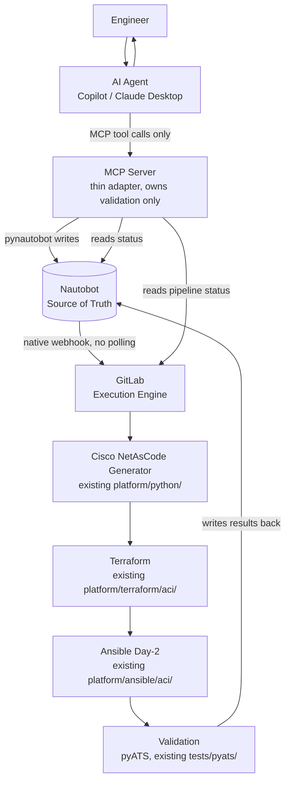
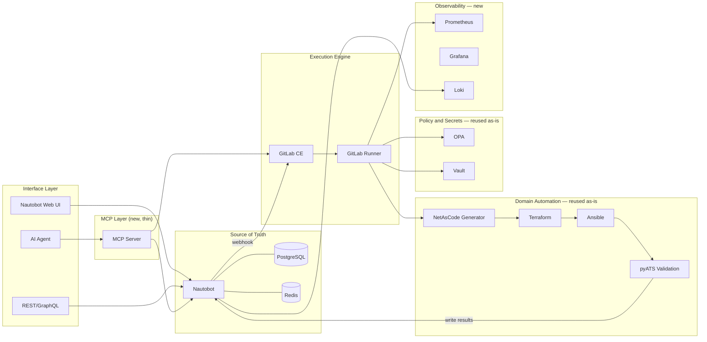
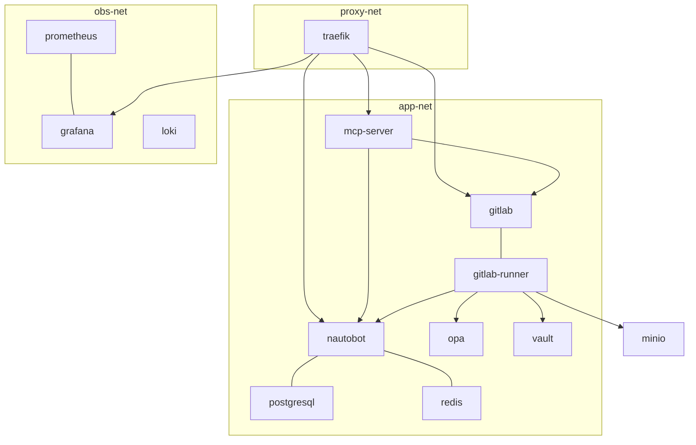
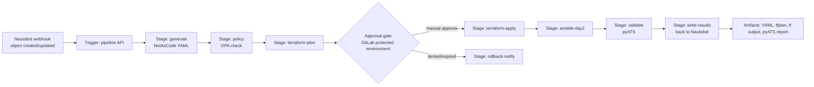
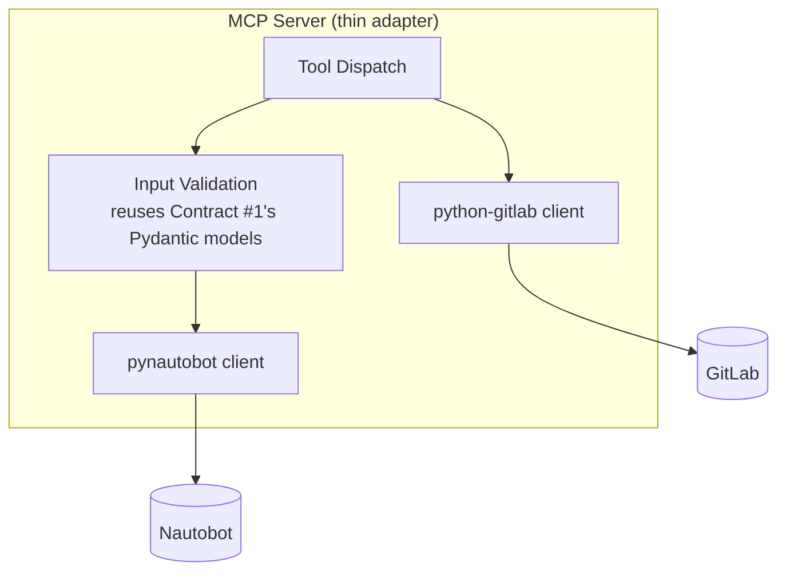
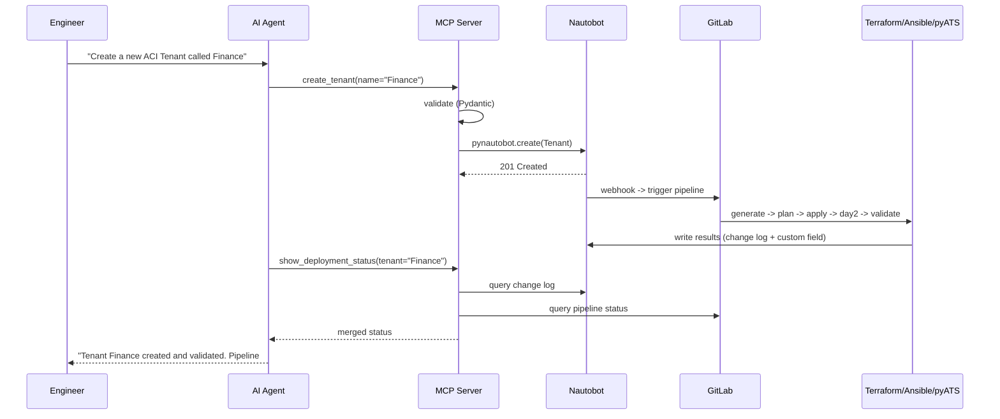

# 06 – AI-Driven Infrastructure Automation Platform — Architecture Evolution

**Project:** Network Platform Engineering Platform

**Document Type:** Architecture Evolution Proposal

**Version:** 1.0

**Status:** Draft — proposal, not yet implemented

**Owner:** Platform Engineering Team

**Date:** 2026-07-24

> **Relationship to existing documents:** this document proposes evolving the architecture described in [`03b-Reference-Architecture.md`](03b-Reference-Architecture.md) and implemented through Milestone 6A (see [`../05-Operations/14-Vertical-Slice-v0.1-Roadmap.md`](../05-Operations/14-Vertical-Slice-v0.1-Roadmap.md)). It does not discard that work — every reused component is named explicitly in [Section 10](#10-platform-api--module-by-module-review) and [Section 11](#11-components-to-retire--keep--summary-classification). Existing Contracts #1-#3 and ADR-001 through ADR-015 remain the historical record of the current implementation; this document proposes which parts of them are superseded and why.

---

## Guiding Judgment Call

The single biggest simplification available: the current Platform API re-implements, in custom Python, three things Nautobot and GitLab already do out of the box — a lifecycle/state machine (Nautobot's native Change Log + GitLab's pipeline status), an approval gate (GitLab protected environments/manual jobs), and a concurrency lock (GitLab's `resource_group`, replacing the `threading.Lock` added to `terraform_executor.py` in Milestone 6A). This is not a rewrite for its own sake — it is removing duplicate machinery once the underlying open-source tool is proven to already provide it.

---

## 1. New Simplified Architecture



**What changes vs. today:** the Platform API's `main.py` (orchestration), `execution_store.py` (state machine), `approval_workflow.py`, and `terraform_executor.py`'s in-process subprocess and lock all disappear as custom code. Their responsibilities do not disappear — they move to Nautobot (state, change log) and GitLab (execution, approval, concurrency). The MCP Server is the only new component, and it is deliberately thin: it validates and translates, it does not orchestrate.

---

## 2. Updated Component Diagram



---

## 3. Container Architecture

| Service | Role | Classification | Health check | Depends on |
|---|---|---|---|---|
| `nautobot` | Source of Truth | Core (existing) | `GET /health/` | postgresql, redis |
| `postgresql` | Nautobot database | Core (existing) | `pg_isready` | — |
| `redis` | Nautobot cache and celery broker | Core (existing) | `redis-cli ping` | — |
| `gitlab` (Omnibus, self-contained) | Execution engine | New — Core | `/-/health` | — |
| `gitlab-runner` | Executes pipeline stages | New — Core | `gitlab-runner verify` | gitlab |
| `vault` | Secrets | Core (existing) | `vault status` | — |
| `opa` | Policy gate | Core (existing), now called from GitLab CI, not Platform API | none (image has no shell — already documented) | — |
| `mcp-server` | AI-facing adapter | New — Core | `GET /health` | nautobot, gitlab |
| `prometheus` | Metrics | New — Reusable (ADR-013 already scoped this, never built) | `/-/healthy` | — |
| `grafana` | Dashboards | New — Reusable | `/api/health` | prometheus, loki |
| `loki` | Logs | New — Reusable | `/ready` | — |
| `minio` | S3-compatible Terraform remote state and GitLab artifact/registry storage | New — Optional but recommended | `/minio/health/live` | — |
| `traefik` | Reverse proxy, TLS, service discovery via Docker labels | New — Optional | `/ping` | — |
| `platform-api` | Legacy custom orchestrator | Replaceable — see [Section 10](#10-platform-api--module-by-module-review) | n/a | — |
| `docs` (MkDocs or similar over existing `docs/`) | Rendered documentation | New — Optional, low priority | — | — |

### 3.1 Network topology



One bridge network (`app-net`) for the core platform, a separate `obs-net` for observability (Prometheus needs to scrape `app-net` targets, so it joins both), and `proxy-net` fronting everything through Traefik. This mirrors the shared reverse-proxy convention already documented elsewhere in this engineering organization's tooling — reusing a pattern already proven to work, not inventing a new one.

### 3.2 Persistent volumes

`nautobot_pg_data`, `nautobot_redis_data` (existing), `gitlab_config`/`gitlab_logs`/`gitlab_data` (GitLab Omnibus needs all three), `vault_data` (existing), `prometheus_data`, `grafana_data`, `loki_data`, `minio_data`. `platform/terraform/aci/` stays a live bind mount, unchanged from Milestone 6A — but once MinIO-backed remote state is adopted ([Section 12](#12-future-roadmap--vxlan-evpn-proof-of-extensibility)), this bind mount and its local-state concurrency concerns disappear entirely.

### 3.3 Startup dependencies

`postgresql`/`redis` → `nautobot` → (`nautobot` registers its webhook to `gitlab`) → `gitlab` → `gitlab-runner` (registers against `gitlab`) → `mcp-server` (needs both `nautobot` and `gitlab` reachable). `opa`/`vault` are independent, only needed once a pipeline actually runs. Observability is fully independent and can start anytime.

### 3.4 Resource requirements (lab-scale, single host)

GitLab Omnibus is the heavy addition — realistically 4 vCPU / 8 GB RAM minimum just for GitLab CE, on top of what Nautobot and PostgreSQL already need (approximately 2 vCPU / 4 GB). Total lab footprint: approximately 8-12 vCPU / 16-24 GB RAM. This is the one real cost of this evolution and should be stated plainly, not hidden — GitLab is not free to run locally.

### 3.5 Folder structure

```text
lab/docker/
  nautobot/            # unchanged
  vault/                # unchanged
  opa/                  # extracted from platform-api's compose into its own service dir
  gitlab/               # new: docker-compose.yml, gitlab.rb config
  gitlab-runner/        # new: registration script, runner config
  mcp-server/           # new: Dockerfile, app source
  observability/        # new: prometheus.yml, grafana provisioning, loki config
  minio/                 # new, optional
  proxy/                 # new, optional (traefik labels-based)
  platform-api/          # retained only through migration; see Section 10
platform/
  canonical_intent/      # reduced role — see Section 10
  python/                 # unchanged, reused as-is
  netascode/              # unchanged, reused as-is
  terraform/aci/          # unchanged, reused as-is
  ansible/aci/            # unchanged, reused as-is
  workflows/              # currently empty — becomes home for shared GitLab CI includes
.gitlab-ci.yml             # new: root pipeline
pipelines/
  aci.gitlab-ci.yml        # new: domain-specific stage definitions
  evpn.gitlab-ci.yml        # future, see Section 12
```

---

## 4. GitLab Pipeline Architecture



**Trigger — webhook, not polling:** Nautobot's built-in Webhooks feature (already a listed out-of-box capability) fires on the relevant object's `created`/`updated` event, POSTing to GitLab's pipeline trigger API (`POST /projects/:id/trigger/pipeline` with a trigger token). No custom listener service is needed — this is a native Nautobot feature calling a native GitLab endpoint directly.

**Concurrency (replaces the `threading.Lock` in `terraform_executor.py`):** GitLab's `resource_group:` keyword serializes jobs targeting the same Terraform working directory/state, queuing concurrent pipeline runs automatically. This is the exact problem Milestone 6A patched with a hand-rolled Python lock — GitLab removes the need for that patch entirely once execution moves here.

**Approval (replaces ADR-015's custom `PENDING_APPROVAL`/`ApproveDeployment`/`DenyDeployment`):** a GitLab protected environment with required approvers on the `terraform-apply` job. `approve_change`/`deny_change` MCP tools become thin calls to GitLab's "play a manual job" / "reject deployment" API — no custom approval state machine.

**Rollback:** re-running the pipeline against a previous Git-committed NetAsCode YAML (each generation is committed to the repo, giving natural Git-based version history) — Terraform's own plan/apply against the older desired state is the rollback mechanism, matching ADR-002's own idempotent-execution principle rather than inventing a new one.

**Artifact storage:** GitLab CI artifacts (or MinIO as an S3-compatible backend for larger artifacts or Terraform remote state) — no separate artifact service needed.

**Pipeline status:** GitLab's own API (`GET /projects/:id/pipelines/:pipeline_id`) — this is exactly what the `show_gitlab_pipeline` MCP tool calls, nothing custom to build.

---

## 5. Nautobot Responsibility Matrix

| Capability | Nautobot feature used | Replaces (custom code) |
|---|---|---|
| Desired-state storage | Native data model (Tenant, VRF, Prefix) plus custom fields for ACI-specific attributes | `nautobot_store.py`'s `canonical_intent` JSON field (kept, simplified) |
| Change history and diff tracking | Native Change Log (built into Nautobot core) | Contract #1's `previous_version`/lineage tracking, `ExecutionState` history |
| Trigger automation | Native Webhooks | Any custom polling/event mechanism |
| In-Nautobot automation | Jobs (for validation-before-write, e.g. naming convention checks) | Some of `technical_policy.py`'s role, optionally |
| Golden Config and drift | Golden Config app (not yet installed — real gap, flagged not assumed) | Would eventually replace the still-unbuilt `DRIFTED` state machinery |
| Data sync from other domains | SSoT app (already partially in use per this repo's own Nautobot ACI SSoT setup) | Not applicable — already in place |
| Secrets references | Secrets and Secrets Groups (native) | Direct Vault calls scattered in Platform API code |
| Multi-interface access | Web UI, REST, GraphQL (all native, already used by the existing generator) | Not applicable |

**Gap, stated honestly:** EPG/Application Profile/Contract/L3Out/Static Path/Policy Group objects have no first-class Nautobot data model today — the existing SSoT only covers Tenant/VRF/Prefix. This is real, scoped future work ([Section 12](#12-future-roadmap--vxlan-evpn-proof-of-extensibility)), not assumed solved.

---

## 6. MCP Server Architecture



**Tools and what each one actually does (no new orchestration invented):**

| Tool | Implementation |
|---|---|
| `create_tenant`, `create_vrf`, `create_bridge_domain`, `create_epg`, `allocate_vlan`, `allocate_subnet`, `create_l3out` | Validate input (reusing `CanonicalIntent`'s Pydantic models as the validation schema, not as a stored object), then a `pynautobot` create/update call |
| `submit_change` | Marks the Nautobot objects as ready (a status field/tag); Nautobot's own webhook does the rest |
| `approve_change` / `deny_change` | Thin call to GitLab's manual-job/environment-approval API |
| `deploy` | Thin call to GitLab's trigger-pipeline API (rarely needed manually — the webhook already does this) |
| `validate` | Reads the pyATS validation stage's result, already written back to Nautobot |
| `rollback` | Triggers a pipeline against a prior Git-committed YAML revision |
| `search_inventory` | Nautobot GraphQL query — no new capability |
| `show_deployment_status` | Nautobot change log and GitLab pipeline status, merged |
| `show_gitlab_pipeline` | Direct GitLab API passthrough |
| `query_knowledge` | Queries the redesigned Knowledge Capture history ([Section 9](#9-knowledge--redesigned-as-deployment-history)) |

The MCP server owns exactly one piece of real logic: input validation before writing to Nautobot. Everything else is a direct call to an existing API. This satisfies "the MCP server owns all platform logic" without contradicting "no custom orchestration layer unless absolutely necessary" — validation is not orchestration.

---

## 7. AI Interaction Sequence



The engineer never touches Terraform, YAML, or GitLab directly — matching the desired experience exactly.

---

## 8. Folder Structure

See [Section 3.5](#35-folder-structure). Net effect: `platform/{python,netascode,terraform,ansible}/` are untouched — this evolution is additive around them, not a rewrite of proven domain automation.

---

## 9. Knowledge — Redesigned as Deployment History

Not an architectural capability (ADR-009's broader framing) — a queryable log, per the request. One record per pipeline run:

```json
{
  "intent": {"tenant": "Finance", "requested_by": "agent"},
  "git_commit": "a1b2c3d",
  "gitlab_pipeline_id": 482,
  "terraform_output": "...",
  "validation_result": "pass",
  "artifacts": ["tfplan.json", "pyats-report.xml"],
  "execution_time_seconds": 47,
  "operator": "jane.doe",
  "agent": "copilot-agent-v1"
}
```

Reuses `jsonl_writer.py`'s generic append primitive unchanged (Reusable), written by the pipeline's final stage rather than by Python application code. `query_knowledge` reads it. This is a strict simplification of the existing `knowledge_capture.py` — same mechanism, triggered from a different place, with a richer record now that Git and pipeline context exist to capture.

---

## 10. Platform API — Module-by-Module Review

| Module | Classification | Why |
|---|---|---|
| `main.py` (routes, `_run_deployment_pipeline`) | Retire | GitLab pipeline stages plus the Nautobot webhook replace the entire orchestration sequence |
| `execution_store.py` (SQLite state machine) | Retire | Nautobot Change Log plus GitLab pipeline status is a strict superset, already durable, already queryable |
| `approval_workflow.py` (ADR-015) | Retire | GitLab protected environment approval is the same capability, native, better audited |
| `terraform_executor.py` (subprocess plus `threading.Lock`) | Move into GitLab CI job | The lock existed only because execution ran in-process; GitLab's `resource_group` removes the need entirely |
| `validation_stub.py` / real validation | Move into GitLab CI job | pyATS already runs standalone (Phase 5) — no reason to invoke it from Python glue code instead of a pipeline stage |
| `aci_materializer.py` | Move into MCP tools | The domain-write logic is exactly what `create_tenant`/`create_vrf`/etc. need — same code, new caller |
| `nautobot_store.py` | Move into Nautobot (native custom field plus pynautobot, no wrapper class needed) | The wrapper added no behavior Nautobot's own API does not already provide directly |
| `technical_policy.py` (OPA client) | Move into GitLab CI `policy` stage | OPA itself is Reusable/Core; only the caller moves |
| `audit_log.py` / `jsonl_writer.py` | Reusable, kept as-is | Generic, cheap, still needed for the redesigned Knowledge history |
| `knowledge_capture.py` | Reusable, redesigned trigger point (see Section 9) | Same code, called from pipeline instead of FastAPI |
| `canonical_intent/models.py` (Contract #1) | Reusable, reduced role | Stops being a persisted object; becomes the MCP server's input-validation schema only |
| Contracts #2/#3 (Platform API specification, Execution Model specification) | Retire as governing documents | Their state machine is superseded by Nautobot and GitLab's native ones; historically valuable, archive rather than delete |
| `docker-compose.yml`/`Dockerfile` (platform-api) | Retire once MCP server is validated | No FastAPI service remains to run |

No custom endpoint survives unchallenged — every one was checked against "does Nautobot or GitLab already do this," and every one had a native equivalent.

---

## 11. Components to Retire / Keep — Summary Classification

| Component | Classification |
|---|---|
| Nautobot, PostgreSQL, Redis | Core |
| Vault, OPA | Core |
| `platform/terraform/aci/`, `platform/ansible/aci/`, `platform/python/` (generator), `platform/netascode/` | Core/Reusable — untouched |
| `tests/pyats/aci/` | Core/Reusable — untouched |
| `audit_log.py`, `jsonl_writer.py`, `knowledge_capture.py`, `aci_materializer.py`, `canonical_intent/models.py` | Reusable — relocated, not rewritten |
| GitLab CE, GitLab Runner | New — Core |
| MCP Server | New — Core |
| Prometheus, Grafana, Loki | Reusable (ADR-013 scoped, never built) — Core once added |
| MinIO, Traefik | Reusable — Optional |
| `execution_store.py`, `approval_workflow.py`, `terraform_executor.py`'s subprocess/lock logic, `main.py`, Contracts #2/#3 | Retire |
| Documentation server | Optional, low priority |

---

## 12. Future Roadmap — VXLAN EVPN (proof of extensibility)

No platform architecture change required — only additive pieces, in the exact same shape as ACI's:

| Layer | ACI (existing) | VXLAN EVPN (future) |
|---|---|---|
| Nautobot model | Tenant/VRF/Prefix plus custom fields | Native VRF/Device/Interface plus new custom fields for VNI/Loopback/BGP AS |
| Generator | `platform/python/generate_aci.py` | `platform/python/generate_evpn.py` (new, same pattern) |
| Terraform | `platform/terraform/aci/` | `platform/terraform/evpn/` (new module, e.g. `cisco.nxos`) |
| Ansible | `platform/ansible/aci/` | `platform/ansible/evpn/` (new) |
| GitLab pipeline | `pipelines/aci.gitlab-ci.yml` | `pipelines/evpn.gitlab-ci.yml` (new, same stage shape) |
| MCP tools | `create_tenant`, etc. | `create_fabric`, `create_vni`, `allocate_loopback`, etc. (new) |

This is the direct generalization of the domain-boundary discipline already established (`aci_materializer.py`/`_aci_tenant_name()` never leaked into domain-agnostic modules) — the same rule now applies at the Nautobot/GitLab/MCP layer instead of the old Platform API layer. Fortinet and Azure follow identically.

**Real gaps to close before EVPN/Fortinet/Azure, stated honestly, not glossed over:** no Nautobot EPG/Contract/L3Out model exists yet even for ACI; no remote Terraform state backend exists yet (the MinIO addition in [Section 3](#3-container-architecture) resolves this and removes the `terraform_executor.py` lock's underlying problem for good); Golden Config app not yet installed for drift.

---

## 13. Migration Plan

1. Stand up GitLab CE plus Runner alongside the existing stack (additive, zero risk to the current stack).
2. Write `.gitlab-ci.yml` stages that call the exact same commands `terraform_executor.py` already runs (`terraform init/plan/apply` with `-lock-timeout`) — a direct port, not a rewrite. Reuse `platform/terraform/aci/` and `platform/python/generate_aci.py` unmodified.
3. Configure Nautobot's native Webhook pointing at GitLab's trigger-pipeline endpoint. Validate end-to-end with a manually created Nautobot object (no MCP server yet).
4. Move `aci_materializer.py`'s logic into a minimal MCP server exposing just `create_tenant`/`create_vrf` first (smallest slice). Validate the full AI-to-Nautobot-to-GitLab-to-live-APIC loop for one object type.
5. Add remaining MCP tools incrementally (`create_bridge_domain`, `allocate_vlan`, `submit_change`, `approve_change`, status/query tools) — no tool requires platform-level changes to add.
6. Redirect Knowledge Capture's write call from FastAPI's `_run_deployment_pipeline` to the GitLab pipeline's final stage.
7. Decommission `lab/docker/platform-api/` once steps 4-6 are validated against the same 44 unit and 7 integration checkpoints already proven this session (ported to validate the new path instead of assuming parity).
8. Add Observability (Prometheus/Grafana/Loki) — independent of everything else, can happen anytime.
