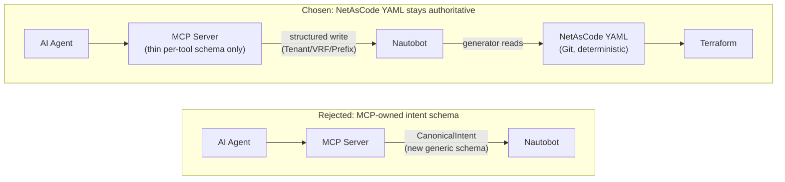

# ADR-018 — NetAsCode YAML as the Authoritative Intent Artifact (Execution Framework Refinement)

**Status:** Accepted

**Date:** 2026-07-28

**Decision Makers:** Platform Engineering Team

**Related ADRs:**

- ADR-007 — Cisco NetAsCode as the Canonical Engineering Model
- ADR-016 — Platform v2 Replacement Architecture
- ADR-017 — Execution Framework as the Phase 2 Model (**rescoped by this decision** — see ADR-017's own note)

**Related architecture:** [`Execution-Framework.md`](../architecture/Execution-Framework.md), [`Platform-v2-Reference-Architecture.md`](../architecture/Platform-v2-Reference-Architecture.md), [`../ai/Future-AI-Integration-Design.md`](../ai/Future-AI-Integration-Design.md)

---

# Context

ADR-017 named the Execution Framework's seven stages and assigned Stage 1 (Intent) and Stage 2 (Validation) to the MCP Server, using a Pydantic `CanonicalIntent` schema inherited from Platform v1 as the artifact that represents desired state on its way into Nautobot.

During review of that design, a sharper question was raised: for a platform whose domain automation is explicitly built around Cisco NetAsCode (ADR-007), is a second, generic, MCP-owned `CanonicalIntent` schema actually necessary — or does it recreate the exact duplication ADR-016 already eliminated once (Platform v1's custom state machine duplicating Nautobot/GitLab-native capabilities)? NetAsCode YAML, generated deterministically from Nautobot and committed to version control, is already a complete, authoritative, technology-specific representation of intent for each domain. A parallel generic schema either duplicates it or forces domain-specific concepts (Tenant, VRF, Bridge Domain, EPG) into an artificial "universal" shape that provides no real benefit and would need to grow a new dialect for every future domain (EVPN, Fortinet, Azure).

---

# Problem Statement

Should the MCP Server define and own its own generic intent schema (`CanonicalIntent`) as the artifact that flows through the Execution Framework, or should the deterministic, version-controlled NetAsCode YAML — already the authoritative Cisco intent model per ADR-007 — serve that role directly, with the MCP Server reduced to exposing business operations that write to Nautobot without inventing a parallel intent representation?

---

# Decision

**NetAsCode YAML is the authoritative intent artifact for domain automation.** It is generated deterministically from Nautobot by the domain generator (`platform/python/generate_aci.py`, and future per-domain equivalents) and version-controlled — this is what flows into Terraform, not a Pydantic object.

The MCP Server's role is narrowed accordingly:

- It exposes **business operations** (`create_tenant`, `deploy_vrf`, `create_bridge_domain`, etc.) as tools, each with its own thin, per-tool input-validation schema (arguments only — tenant name, VRF name, CIDR, and so on).
- It **does not** define or own a shared generic intent envelope that all domains must fit into. There is no cross-domain `CanonicalIntent` object flowing through the Execution Framework.
- It writes tool call results directly to Nautobot as structured objects (Tenant, VRF, Prefix, etc.), the same way a human using the Nautobot UI would — it does not translate a business operation into an intermediate intent object first.
- It **orchestrates the workflow** (triggers the pipeline, reports status back) — it does not **own** the workflow's data model. This sharpens, rather than contradicts, ADR-016's existing principle that the MCP Server "must never become another orchestration engine."

This also resequences the Execution Framework's build order (ADR-017's original milestone-agnostic design is replaced by an explicit six-milestone sequence, recorded in [`Execution-Framework.md` §6](../architecture/Execution-Framework.md#6-implementation-milestones)): the GitLab pipeline, the Nautobot→NetAsCode generator, Policy/Approval, and Verification/Knowledge Capture are all built and proven using **existing, already-committed NetAsCode YAML** — with no AI or MCP Server involved at all — before the MCP Server is built, and AI agents are connected only in the final milestone. This is a deliberate de-risking order: the highest-value, most-proven part of the platform (Terraform/Ansible/pyATS against real NetAsCode YAML) is exercised through the full pipeline first; the newest, least-proven part (MCP Server, AI orchestration) is added last, against an already-working pipeline.

*The rejected design would have made the MCP Server invent and own a second, parallel intent representation — duplicating exactly what ADR-016 already removed once. The chosen design keeps NetAsCode YAML as the one artifact Terraform ever consumes.*

---

# Consequences

- **ADR-017 is rescoped, not replaced** — its seven named stages (Intent → Validation → Policy → Approval → Execution → Verification → Knowledge Capture) remain the lifecycle model. Only Stage 1 and Stage 2's *ownership and artifact* change: Intent's artifact is now NetAsCode YAML (produced by the generator reading Nautobot), not a Pydantic `CanonicalIntent` written by the MCP Server; Validation's schema-level check moves from "MCP Server validates a generic intent object" to "the generator/Terraform toolchain validates the generated YAML is well-formed and deterministic" (see Execution-Framework.md §2.1/§2.2, updated).
- `schemas/common.py` in the MCP Server's planned package layout (Platform-v2-Reference-Architecture.md §7.1) is no longer a shared `CanonicalIntent` base class inherited from Platform v1. Each domain's tool arguments are validated by their own small, tool-specific schema in `schemas/aci.py` (and future `schemas/evpn.py`, etc.) — there is no shared generic base beyond ordinary Pydantic conventions.
- Platform v1's `CanonicalIntent` Pydantic model (originally `platform/canonical_intent/`, archived 2026-07-30 to [`archive/platform-v1/`](../../archive/platform-v1/README.md) once nothing in the current architecture referenced it), already marked "reduced role, not deletion" by ADR-016, is reduced further: it is not the Execution Framework's intent artifact. It may still be referenced informally for individual field-validation conventions already proven useful, but it is not resurrected as a governing schema.
- This does not change ADR-007 (NetAsCode as the canonical engineering model) — it reaffirms and operationalizes it as the literal artifact the Execution Framework's Intent stage produces.
- This does not change ADR-010's "AI reasons, the platform executes" boundary, nor ADR-016's MCP-Server-never-orchestrates-multi-step-workflows principle — both are reaffirmed, and this decision sharpens the second one by also ruling out MCP owning the workflow's *data model*, not just its *sequencing*.
- Explicitly leaves room for additional domains (Azure, Fortinet, EVPN) without forcing a universal intent schema — each domain contributes its own generator and its own NetAsCode/equivalent dialect, exactly as ADR-007 already envisioned.
