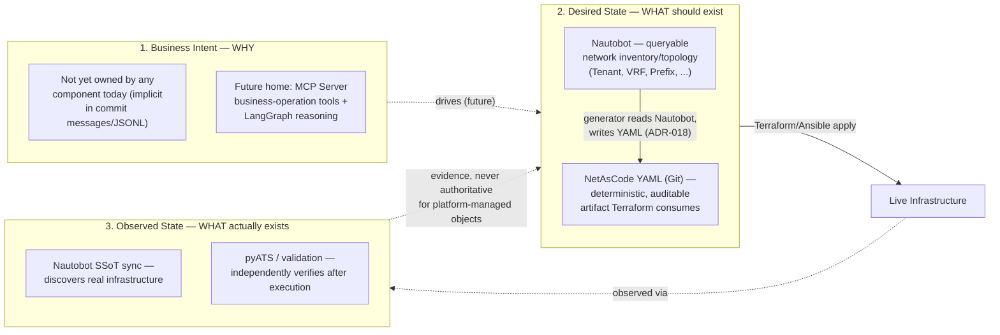

# ADR-019 — Three Truths Principle and Intent Layer Forward-Compatibility

**Status:** Accepted

**Date:** 2026-07-28

**Decision Makers:** Platform Engineering Team

**Related ADRs:**

- ADR-001 — Nautobot as the Source of Truth (scope narrowed by this ADR)
- ADR-007 — Cisco NetAsCode as the Canonical Engineering Model
- ADR-016 — Platform v2 Replacement Architecture
- ADR-017 — Execution Framework
- ADR-018 — NetAsCode YAML as the Authoritative Intent Artifact

---

# Context

ADR-001 states "Nautobot is the Source of Truth" without distinguishing *which truth*. Through the vertical-slice implementation (Milestones 1-6A), the Execution Framework design (ADR-017), and architectural review, three distinct kinds of truth emerged — each requiring different ownership, storage, and query patterns. Treating them as one conflates concerns that become irreconcilable once the platform manages more than one infrastructure domain.

Additionally, while the current single-domain scope (Cisco ACI) is well-served by Nautobot alone, future domains (Fortinet security policies, Azure WAF rules, NAC posture policies) contain objects that do not fit Nautobot's DCIM/IPAM data model. The platform must not assume every future domain's state belongs in Nautobot.

---

# The Three Truths

A network automation platform operates on three distinct truths. Conflating any two creates an architectural defect that compounds with every new domain.

*Conflating any two boxes above is the exact defect this ADR prevents — e.g. treating Nautobot's SSoT-discovered "Observed State" as if it were "Desired State" would let brownfield drift silently overwrite intent.*

## 1. Business Intent — *Why* does this change exist?

What outcome the change serves, what policy governs it, what approval it requires, and what business context surrounds it. Examples:

- "Create a PCI payment application zone" (maps to multiple objects across multiple domains)
- "Customer ABC needs internet-facing connectivity with standard security profile"
- "Decommission the staging environment by end of quarter"

**Not Nautobot's responsibility.** Nautobot stores network objects (Tenant, VRF, Prefix), not the business rationale that caused them to be created. Business intent today is implicit (stored only in commit messages, JSONL knowledge records, and human memory). A future intent layer — likely the MCP Server's business-operation tools coordinated by LangGraph's reasoning — will own this explicitly. This ADR does not build that layer; it ensures the current design does not prevent it.

## 2. Desired State — *What* should exist on the infrastructure?

The specific, technology-aware objects that should be provisioned and their configuration. Two complementary representations:

- **Nautobot** — network inventory and topology in a queryable, relationship-aware model (Tenants, VRFs, Prefixes, Interfaces, Devices). This is where humans and the MCP Server write desired network state. *Authoritative per ADR-001 for objects that fit its DCIM/IPAM model.*
- **NetAsCode YAML (Git)** — the deterministic, version-controlled, technology-specific expression of that state that Terraform actually consumes. Generated from Nautobot by a domain-specific generator (`generate_aci.py`). *Authoritative as the Git-committed desired-state artifact per ADR-018.*

These are complementary, not competing: Nautobot is the queryable origin, NetAsCode YAML is the auditable Git artifact. Neither claims to be the other's master.

**For future non-network domains** (Fortinet security policies, Azure WAF, NAC), desired state may live in a domain-specific SoT alongside Nautobot — not forced into Nautobot's data model when it doesn't fit.

## 3. Observed State — *What* actually exists right now?

What the live infrastructure currently looks like, independently verified. Two sources:

- **Nautobot** (via SSoT sync) — discovers and imports actual infrastructure state for inventory visibility and brownfield onboarding (see ADR-001's Amendment).
- **pyATS / validation** — independently verifies that infrastructure matches desired state after execution (Execution Framework Stage 6).

Observed state is never authoritative for platform-managed objects (ADR-001's Managed State rules). It is evidence, not intent.

---

# Decision

## The Three Truths are distinct and must never be conflated.

Each truth has its own owner, its own lifecycle, and its own query pattern. No single component should try to store all three. Specifically:

| Truth | Current owner | Future owner (when it diverges) |
|---|---|---|
| Business Intent | Implicit — commit messages, JSONL records, human memory | MCP Server business-operation tools + LangGraph reasoning layer |
| Desired State (network) | Nautobot → NetAsCode YAML (Git) | Same — unchanged |
| Desired State (non-network, future) | N/A — no non-network domain exists yet | Domain-specific SoT per domain, coordinated by the orchestration layer |
| Observed State | Nautobot (SSoT sync) + pyATS | Same — unchanged |

## The intent layer is a recognized future architectural need.

The platform does not build a business-intent layer today (single-domain, premature complexity). But the current design must not prevent one from being added later. Concretely:

- The MCP Server's tools are domain-specific (`create_tenant`, `create_vrf`) and write directly to Nautobot — this is correct and stays. But the MCP Server's tool registry is deliberately open to *business-operation tools* (`provision_customer_zone`, `decommission_environment`) in the future.
- When business-operation tools exist, multi-domain coordination is the responsibility of the **AI/LangGraph reasoning layer calling MCP tools in sequence** — not the MCP Server orchestrating internally. This preserves ADR-016's "MCP must never become another orchestration engine" principle while acknowledging that multi-domain operations require *someone* to coordinate.
- No component in the current architecture assumes it is the *only* SoT. Nautobot is the SoT for network inventory and topology (ADR-001, narrowed). NetAsCode YAML is the Git-committed desired-state artifact (ADR-018). Neither claims ownership of business intent or non-network-domain state.

## Domain-adapter boundaries are defined explicitly.

When a new infrastructure domain is added, the platform team must answer:

1. **Do this domain's objects fit Nautobot's DCIM/IPAM model?** If yes (e.g. EVPN — still network objects), its desired state lives in Nautobot, with a domain-specific generator producing its own NetAsCode/equivalent YAML. If no (e.g. FortiGate security policies), it gets its own domain-specific SoT, its own generator, and its own Execution Framework pipeline — coordinated at the MCP/AI layer, not merged into Nautobot.
2. **Does this domain share objects with an existing domain?** If yes (e.g. a VRF referenced by both ACI and Fortinet), Nautobot owns the shared object, and each domain's generator reads it from Nautobot.

---

# What This ADR Does NOT Change

- ADR-001 (Nautobot as SoT for network inventory/topology) — narrowed, not revoked.
- ADR-018 (NetAsCode YAML as the intent artifact, no generic schema) — unchanged. The intent layer, when built, will produce business-operation calls that result in Nautobot writes and domain-specific YAML, not a competing generic intent schema.
- The Execution Framework's 7 stages — unchanged.
- The Milestone 1 pipeline — unchanged. It works. Nothing about this ADR retroactively invalidates it.
- The current code, infrastructure, or Docker topology — nothing changes. This ADR is a design-principle update, not a code change.

---

# Consequences

- ADR-001's "Nautobot is the Source of Truth" is now explicitly scoped to "for network inventory and topology." Its governing status for network-shaped domains is *strengthened*, not weakened, by making the scope explicit rather than leaving it overloaded.
- Future architecture docs, ADRs, and MCP Server designs should reference the Three Truths distinction when discussing SoT ownership rather than treating "SoT" as a single undifferentiated concept.
- When the first non-network domain (likely Fortinet) is added, this ADR is the decision record that governs whether its state goes into Nautobot or gets its own SoT — the answer is determined by the domain-adapter boundary question above, not by defaulting everything into Nautobot.
- The intent layer remains explicitly deferred. This ADR recognizes it as architecturally necessary for multi-domain, business-level operations — it does not authorize building it now.
