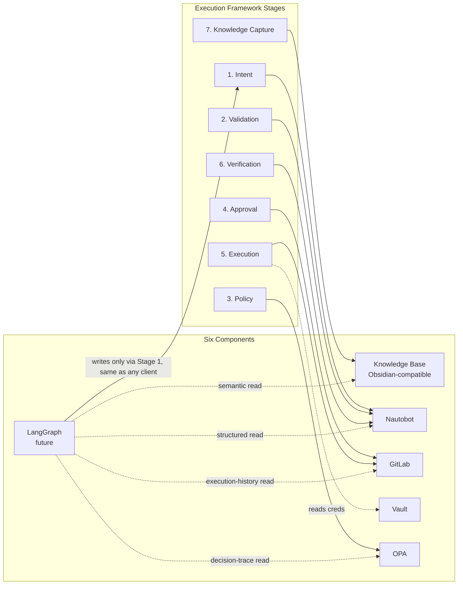

# Future AI Integration Design

**Project:** Network Platform Engineering Platform

**Document Type:** Architecture — Future AI Integration

**Status:** Approved design — LangGraph itself deferred to a later phase

**Owner:** Platform Engineering Team

**Date:** 2026-07-28

> **Relationship to other documents:** this document maps six components — this Obsidian-compatible knowledge base, Nautobot, GitLab, HashiCorp Vault, OPA, and a future LangGraph reasoning layer — onto the [Execution Framework](../architecture/Execution-Framework.md)'s seven stages. It extends [`AI-Architecture.md`](AI-Architecture.md) and [`Knowledge-Layer.md`](Knowledge-Layer.md) rather than replacing them; those documents' principle — **"AI reasons, the platform executes"** — is unchanged and non-negotiable here. LangGraph is *designed for* in this document; it is not *built* by it. Per [ADR-018](../adr/ADR-018-NetAsCode-Centric-Execution-Framework.md), NetAsCode YAML — not a shared intent schema — is the authoritative intent artifact; nothing below changes that.

---

# 1. Why Design This Now, Before Building LangGraph

The Execution Framework's seven stages (Intent → Validation → Policy → Approval → Execution → Verification → Knowledge Capture) already define exactly where a future reasoning layer would need to read from and write to. Designing that mapping now — while the six underlying components already exist or are already scoped — means LangGraph's eventual introduction is a matter of building one new reasoning component against an already-stable contract, not renegotiating six integration points at once, later, under time pressure.

---

# 2. The Six Components and Their Role

| Component | Role today | Role in the Execution Framework | Consumed by future AI as |
|---|---|---|---|
| **This knowledge base** (`knowledge/`, Obsidian-compatible) | Semantic knowledge — architecture, ADRs, runbooks, validation evidence | Not a lifecycle stage itself — it is the accumulated record *of* every past Intent→Knowledge-Capture cycle, plus all architecture/ADR context | **Semantic retrieval corpus** — indexed as-is (per `knowledge/README.md`'s existing design intent), chunked per atomic document |
| **Nautobot** | Source of Truth for desired state, inventory, topology | Owns stage 1's structured-state write and stage 2's referential Validation; the domain generator reads it to produce the NetAsCode YAML that is the Execution Framework's actual Intent artifact (ADR-018); also the durable read target for stage 6's Verification write-back | **Structured retrieval target** — queried live via GraphQL/REST, never duplicated into the knowledge base (existing boundary rule, unchanged) |
| **GitLab** | Execution engine | Owns stage 4 (Approval, native protected environments) and stage 5 (Execution) outright; hosts stage 3's Policy job and stage 7's Knowledge Capture job | **Execution history source** — pipeline status, job logs, and artifacts queried via API for `show_status`-style aggregation (already an MCP Server responsibility per Platform-v2-Reference-Architecture.md §7.7) |
| **HashiCorp Vault** | Secrets | Not a lifecycle stage; a cross-cutting dependency every stage that touches real credentials (Execution's Terraform/Ansible jobs, the MCP Server's own service-account credentials) reads from at runtime | **Never** a retrieval or reasoning target — AI never receives credential material, direct or indirect (unchanged from ADR-010/§7.3's "AI never receives privileged or direct access to execution engines") |
| **OPA** | Policy | Owns stage 3 (Policy) outright | **Decision-explanation source** — a future reasoning layer may surface *why* a Policy job denied a change (reading the job's Rego trace/output as evidence), but never bypasses or re-implements the decision itself |
| **LangGraph (future)** | Not yet built | Not an owner of any stage — a cross-cutting reasoning layer that *reads* stage outputs (Nautobot state, GitLab pipeline/job status, this knowledge base, OPA decision traces) to answer engineer questions and *writes* only through the same Intent stage (stage 1) every other client uses | **N/A — this is the future consumer being designed for**, not a data source |

---

# 2.1 Why LangGraph Is Not Just "Another MCP Client"

The MCP Server (Platform-v2-Reference-Architecture.md §7) already accepts tool calls from any AI agent, including a future LangGraph-based one — no new write path is invented for LangGraph. What LangGraph adds, when built, is the **reasoning layer that combines** three read sources the MCP Server does not itself combine today:

1. **Semantic retrieval** from this knowledge base (architecture context, past decisions, prior incident write-ups like the [Phase 1 Infrastructure Validation Report](../runbooks/Phase1-Infrastructure-Validation-Report.md)).
2. **Structured retrieval** from Nautobot (live current state).
3. **Execution history** from GitLab (pipeline/job status) and the Knowledge Capture JSONL records (per-execution structured history).

This three-way combination is exactly what `knowledge/README.md` already commits to: *"LangGraph (future) = the reasoning layer that will combine user intent, semantic retrieval from this vault, and structured retrieval from Nautobot."* This document adds the third source (GitLab execution history + Knowledge Capture records) to that commitment, since the Execution Framework did not exist as a named lifecycle when that line was originally written.

---

# 3. Mapping onto the Execution Framework Stages

**The one rule this diagram exists to enforce:** every dotted arrow into `LG` is a **read**. The only solid arrow out of `LG` targets Stage 1 (Intent) — the same entry point every other client (engineer, existing AI agent, CLI, portal) already uses. LangGraph never gets a private write path, never touches Vault, and never re-implements Policy's decision — it only reasons over what the other six components already expose, then submits an Intent like anyone else.

---

# 4. What Changes When LangGraph Is Eventually Built

Nothing about the six components' existing roles changes. LangGraph is additive:

* The knowledge base does not need reorganizing (per `knowledge/README.md`'s explicit design goal — "no repository reorganization required when that day comes").
* Nautobot, GitLab, Vault, and OPA are not modified — LangGraph queries them the same way the MCP Server or a human already does.
* The MCP Server gains no new responsibilities other than accepting LangGraph as one more authenticated client (Platform-v2-Reference-Architecture.md §7.3's two-auth-boundary model already accommodates this — "AI client → MCP Server" auth is per-client, and LangGraph is just another client entry in that list).

**Explicitly out of scope until a later phase, even after this design is agreed:** any Vector DB, embedding pipeline, or actual LangGraph graph/agent code. This document is the contract those future components will be built against — it does not build them.
