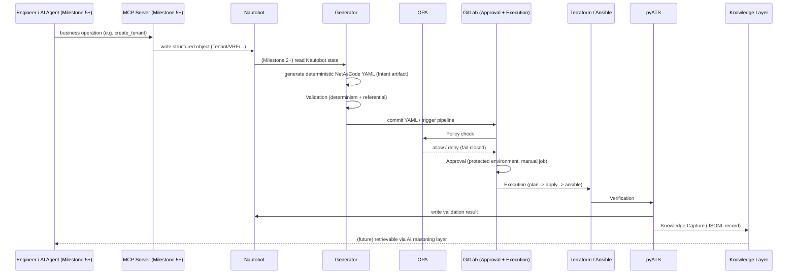

# Execution Framework

**Project:** Network Platform Engineering Platform

**Document Type:** Architecture — Execution Lifecycle Design

**Status:** Approved — design complete, implementation not yet started (Phase 2)

**Owner:** Platform Engineering Team

**Date:** 2026-07-28

> **Decision records:** [ADR-017](../adr/ADR-017-Execution-Framework.md) (the seven-stage lifecycle) and [ADR-018](../adr/ADR-018-NetAsCode-Centric-Execution-Framework.md) (rescopes Stage 1/2's artifact to NetAsCode YAML, not a Pydantic `CanonicalIntent`). **Supersedes** the framing of Phase 2 as "GitLab CI" in [`Roadmap.md`](Roadmap.md). **Depends on:** [`Platform-v2-Reference-Architecture.md`](Platform-v2-Reference-Architecture.md) for component definitions, [`Platform-v2-As-Built.md`](Platform-v2-As-Built.md) for what is actually deployed today. **Companion:** [`../ai/Future-AI-Integration-Design.md`](../ai/Future-AI-Integration-Design.md) maps the future AI/reasoning layer onto this same lifecycle.

---

# 1. Why a Named Lifecycle, Not "Build the Pipeline"

GitLab CI is an execution engine. It is very good at one thing — running ordered, retryable, approvable jobs — but it is not itself a lifecycle model, and treating "Phase 2" as synonymous with "GitLab CI" risks writing pipeline YAML before agreeing what each stage is actually responsible for, who owns it, and what it hands to the next stage. This document names and orders that lifecycle first. GitLab CI implements exactly one of its seven stages.

```text
Intent → Validation → Policy → Approval → Execution → Verification → Knowledge Capture
```

Every arrow above is a handoff between two different owning components — never a handoff within GitLab CI alone (Execution is the only stage GitLab CI owns end-to-end).

---

# 2. Stage-by-Stage Design

## 2.1 Intent

**Owner:** two different producers of the same artifact, per [ADR-018](../adr/ADR-018-NetAsCode-Centric-Execution-Framework.md):

* **Milestones 1-4 (no AI/MCP involved):** an existing, already-committed NetAsCode YAML file (`platform/netascode/aci/tenants.yaml`) authored or generated ahead of time. The pipeline is proven against this before any generator or MCP work exists.
* **Milestone 2 onward:** the domain generator (`platform/python/generate_aci.py`) reads Nautobot and produces the same deterministic, version-controlled NetAsCode YAML.
* **Milestone 5+ (once the MCP Server exists):** an engineer or AI agent calls an MCP tool (`create_tenant`, `deploy_vrf`, etc.), which writes structured objects (Tenant, VRF, Prefix) directly to Nautobot — the same shape a human editing the Nautobot UI would produce. The MCP Server does **not** translate the call into an intermediate generic intent object first; there is no MCP-owned `CanonicalIntent` schema in this lifecycle (this is what ADR-018 changed from ADR-017's original framing).

**In every case, the artifact that actually represents intent for domain automation is the NetAsCode YAML itself** — deterministic and Git-committed. Per [ADR-019](../adr/ADR-019-Three-Truths-Principle.md)'s Three Truths principle, this stage operates on **Desired State** (Truth #2), not Business Intent (Truth #1). Business Intent — *why* this change was requested, what outcome it serves — is implicit today and will be owned by the future AI/MCP layer when it is built. This stage does not need to know *why*; it only needs to produce a valid, auditable desired-state artifact. Nautobot remains the Source of Truth for *network inventory and topology* (ADR-001, scoped); NetAsCode YAML is the *generated, technology-specific expression* of that state that Terraform actually consumes. Nothing downstream invents new desired state — every later stage reads the YAML that Intent produced.

**Output:** a version-controlled NetAsCode YAML file, plus (once Nautobot is the origin) its native Change Log entry recording who/when/what changed upstream.

## 2.2 Validation

**Owner:** the generator + Terraform toolchain (not the MCP Server — see ADR-018).

Two distinct checks, not one:

* **Schema/determinism validation** — is the generated YAML well-formed, and does regenerating it from the same Nautobot state produce byte-identical output? (Current-State.md's generator behavior already establishes this discipline — no MCP Server involved.) Once the MCP Server exists, its own per-tool argument schemas (Platform-v2-Reference-Architecture.md §7.2) validate business-operation *inputs* before they reach Nautobot — but that is a separate, upstream check on the MCP tool call itself, not a re-validation of the YAML.
* **Referential validation** — does the generated YAML make sense against current state? (e.g. does the referenced Tenant/VRF actually exist before a Bridge Domain references it.) This runs against Nautobot using the same GraphQL/REST queries the generator already relies on.

This is deliberately **not** the same thing as Policy (2.3) — Validation asks "is this technically coherent," Policy asks "is this allowed." The same split ADR-014 already drew between Technical Policy and Deployment Approval applies here between Validation and Policy.

**Output:** pass/fail with a specific reason. A Validation failure never reaches the later pipeline stages.

## 2.3 Policy

**Owner:** OPA, invoked as a **GitLab CI job** (this is the resolved OPA-extraction question — see ADR-017's Consequences).

Once Nautobot's webhook triggers the pipeline, the first real pipeline stage calls OPA with the same Rego policies already proven in Phase 1-era work (`policy/cisco_aci/tenant_naming.rego` and equivalents) — naming conventions, environment restrictions, tenant quotas, change-window rules. Per ADR-014's fail-closed principle, an unreachable OPA fails the job, it never silently proceeds.

**Output:** the GitLab job's pass/fail status is the policy decision — no separate audit trail needed, the job log **is** the record (Platform-v2-Reference-Architecture.md §6).

## 2.4 Approval

**Owner:** GitLab **protected environments**, native manual job.

Replaces ADR-015's custom `approval_workflow.py` entirely, per ADR-016. A manual job gated behind a protected environment requires a designated approver to click "Run" before Execution proceeds. Lab/non-production environments can be configured with no required approvers (native GitLab support), preserving Platform v1's observed behavior where lab deployments reach ACCEPTED immediately while production requires an explicit approval.

**Output:** the pipeline either proceeds to Execution or stays blocked — GitLab's own pipeline state is the approval record.

## 2.5 Execution

**Owner:** GitLab CI + GitLab Runner. **The only stage GitLab CI implements end-to-end**, and the only stage this document treats as "the pipeline" in the narrow sense.

Runs, in order, against the proven domain automation (unchanged, per Platform-v2-Reference-Architecture.md's Mandatory Design Principle #4):

1. **Generate** — `platform/python/generate_aci.py` (or future `generate_evpn.py`) reads Nautobot, produces NetAsCode YAML.
2. **Terraform Plan** — `platform/terraform/aci/` (unchanged), `resource_group:` serializes plan/apply per domain+environment — the exact capability that a Phase 1 concurrency issue (two `terraform apply` runs contending for the same provider plugin — see the [Infrastructure Validation Report](../runbooks/Phase1-Infrastructure-Validation-Report.md) §9) already demonstrated the ad hoc script-execution model lacks.
3. **Terraform Apply** — same module, `-auto-approve` after Approval (2.4) has already gated the job.
4. **Ansible** — `platform/ansible/aci/` Day-2 playbooks, unchanged.

**Output:** Terraform state/output, Ansible run logs, all published as GitLab CI artifacts (or to MinIO for larger objects, once wired — see Platform v2 As-Built §6 item 3).

## 2.6 Verification

**Owner:** pyATS (`tests/pyats/aci/job.py`, unchanged), run as a GitLab CI job immediately after Execution.

Confirms the infrastructure actually reflects the intent that was executed — not just that Terraform/Ansible exited zero. A **Write Results** step immediately follows, writing the validation outcome back to Nautobot (a custom field or tag on the affected object) via `pynautobot` — this closes the loop back to the Source of Truth, matching Platform-v2-Reference-Architecture.md §6's "Write Results" stage.

**Output:** a pyATS report (artifact) and a Nautobot-side status update.

## 2.7 Knowledge Capture

**Owner:** the reused `jsonl_writer.py` pattern (per ADR-009), run as the final GitLab CI stage.

Appends one structured record — intent, Git commit, pipeline ID, Terraform output reference, validation result, artifacts, execution time, operator/agent identity — capturing this specific execution as reusable engineering memory. This is deliberately **not** a duplicate of Nautobot's Change Log (which records desired-state history) or GitLab's pipeline history (which records execution history) — it is the cross-cutting record that ties a single Intent to its Policy decision, its Approval, its Execution artifacts, and its Verification result in one place, which is exactly what the Knowledge Layer (`../ai/Knowledge-Layer.md`) is designed to consume later.

**Output:** one JSONL record. See [`../ai/Future-AI-Integration-Design.md`](../ai/Future-AI-Integration-Design.md) for how this record eventually becomes retrievable by a future AI reasoning layer.

---

# 3. Stage Ownership Summary

| Stage | Owner | Native capability used | Where it runs |
|---|---|---|---|
| 1. Intent | Generator (→ Nautobot origin from Milestone 2; MCP Server from Milestone 5) | Deterministic YAML generation, Git commit, Nautobot Change Log (once wired) | Before any pipeline runs |
| 2. Validation | Generator + Terraform toolchain + Nautobot | Determinism check + live referential query | Before the pipeline's Policy job |
| 3. Policy | OPA | Rego, fail-closed | GitLab CI job (first pipeline stage) |
| 4. Approval | GitLab | Protected environment, manual job | GitLab CI (native, no custom code) |
| 5. Execution | GitLab CI + Runner | `resource_group:`, `retry:`, `artifacts:` | GitLab CI jobs (Generate/Plan/Apply/Ansible) |
| 6. Verification | pyATS + Nautobot | Domain validation, write-results script | GitLab CI job |
| 7. Knowledge Capture | `jsonl_writer.py` | Structured JSONL append | Final GitLab CI job |

**The single sentence this table exists to justify:** GitLab CI is the execution engine inside this workflow — it owns stage 5 outright and hosts stage 4's native gate, but stages 1, 2, 3, 6, and 7 are owned by other components (the generator, Nautobot, OPA, pyATS, the Knowledge Layer writer), not by GitLab. **The MCP Server does not appear as the owner of any stage** until Milestone 5, and even then it only originates Stage 1's YAML indirectly (via a Nautobot write the generator subsequently reads) — per ADR-018, it never owns a parallel intent schema.

---

# 4. Sequence Diagram



Note the diagram's own ordering: Milestones 1-4 exercise everything from `Gen` (or a hand-committed YAML) rightward, with no `Eng`/`MCP` box involved at all — those two participants only enter the picture at Milestone 5.

---

# 5. Relationship to the Roadmap

[`Roadmap.md`](Roadmap.md)'s Level 3 ("Platform Engineering" — CI/CD pipelines, Policy as Code, Observability) and Level 4 ("AI-Augmented Platform" — MCP integration, Knowledge retrieval) both assumed these capabilities would exist without specifying their order or handoffs. This document is that missing specification. Phase 2 work (pipeline YAML, OPA CI integration, GitLab Runner registration) is scoped against the stage table in §3 — a pipeline stage is not considered designed until its row in that table is filled in and agreed, not the other way around.

---

# 6. Implementation Milestones

Per [ADR-018](../adr/ADR-018-NetAsCode-Centric-Execution-Framework.md), Phase 2 is built **domain-automation-first**: the pipeline, generator, policy/approval, and verification/knowledge-capture stages are all proven using existing NetAsCode YAML with no AI or MCP Server involved, before the MCP Server or any AI agent touches the platform at all.

## Milestone 1 — GitLab Execution Pipeline

* Register the GitLab Runner against GitLab CE; verify with `gitlab-runner verify`.
* Build the first end-to-end pipeline (`.gitlab-ci.yml` + `pipelines/includes/common.gitlab-ci.yml` + `pipelines/aci.gitlab-ci.yml`, per Platform-v2-Reference-Architecture.md §6's folder layout) covering: NaC validation → OPA policy check → Terraform execution → Ansible (if applicable) → pyATS verification → deployment-result capture.
* **Input:** the existing, already-committed `platform/netascode/aci/tenants.yaml` — no generator, no Nautobot read, no AI/MCP involved yet.
* **Gate:** one full pipeline run succeeds end-to-end against the ACI simulator using this static YAML input.

## Milestone 2 — Nautobot → NetAsCode Integration

* Formalize how Nautobot data is converted into NetAsCode YAML (already implemented in `platform/python/generate_aci.py` — this milestone hardens and documents it as the domain automation layer's boundary, per ADR-018).
* Confirm the generator's output is deterministic (byte-identical YAML for unchanged Nautobot state) and that the generated file is version-controlled (committed by a pipeline job, not left as a local gitignored artifact).
* **Gate:** the Milestone 1 pipeline now runs against generator output instead of the static fixture, with no other pipeline changes required.

## Milestone 3 — Policy & Approval

* Integrate OPA into the pipeline as a first-class job (already scaffolded in Milestone 1; this milestone exercises it properly), reusing `docker/platform-api/policy/cisco_aci/tenant_naming.rego`.
* Configure GitLab protected-environment approval gates (production requires an approver; lab does not).
* **Gate:** demonstrate one compliant deployment (passes Policy, proceeds through Approval) and one deliberately non-compliant deployment (denied by Policy, never reaches Execution).

## Milestone 4 — Verification & Knowledge Capture

* Confirm the Write Results step updates Nautobot with deployment status (custom field/tag) after pyATS verification.
* Confirm pyATS results and other deployment evidence are published as pipeline artifacts.
* Wire the final Knowledge Capture job (`jsonl_writer.append_jsonl()`) to append one record per pipeline run to the knowledge/operational log.
* **Gate:** a full pipeline run leaves three durable traces — a Nautobot status update, an artifact bundle, and a knowledge record — all traceable to the same pipeline ID.

## Milestone 5 — MCP Server

* Scaffold `mcp-server/` (Platform-v2-Reference-Architecture.md §7): tool registry, Nautobot/GitLab/Vault clients, business-operation tools (`create_tenant`, `deploy_vrf`, etc.), each with its own thin per-tool argument schema — **no shared `CanonicalIntent` envelope** (ADR-018).
* The MCP Server orchestrates — it calls Nautobot to write the operation's result, and triggers/monitors the Milestone 1-4 pipeline. It does not re-implement any pipeline stage itself.
* **Gate:** an MCP tool call results in a Nautobot write, a triggered pipeline run, and a status readable back through the MCP Server — using the exact same pipeline built in Milestones 1-4, unmodified.

## Milestone 6 — AI Agents

* Connect Claude Desktop, the VS Code Copilot Agent, and (later) LangGraph-based agents to the MCP Server as clients (Platform-v2-Reference-Architecture.md §7.3's two-auth-boundary model).
* AI remains responsible for orchestration/reasoning (which tool to call, how to explain the result); NetAsCode YAML remains the authoritative Cisco intent model throughout — AI never bypasses it, never generates it directly, and never touches Terraform/Vault/GitLab credentials.
* **Gate:** an AI agent completes one full business operation ("create a Tenant") end-to-end through the MCP Server with no manual pipeline triggering.

