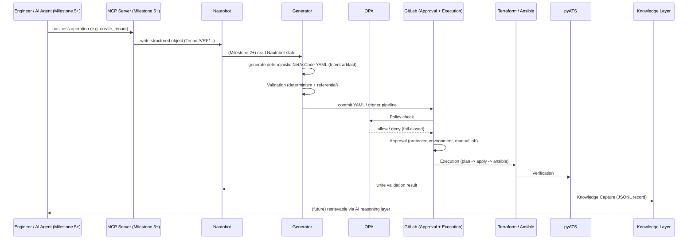

# Execution Framework

**Project:** Network Platform Engineering Platform

**Document Type:** Architecture — Execution Lifecycle Design

**Status:** Approved — design complete; all 6 milestones implemented and verified against live infrastructure (see §6). Domain coverage (ADR-020, §7) is complete as of 2026-07-29.

**Owner:** Platform Engineering Team

**Date:** 2026-07-28 (implementation status last updated 2026-07-29)

> **Decision records:** [ADR-017](../adr/ADR-017-Execution-Framework.md) (the seven-stage lifecycle) and [ADR-018](../adr/ADR-018-NetAsCode-Centric-Execution-Framework.md) (rescopes Stage 1/2's artifact to NetAsCode YAML, not a Pydantic `CanonicalIntent`). **Supersedes** the framing of Phase 2 as "GitLab CI" in [`Roadmap.md`](Roadmap.md). **Depends on:** [`Platform-v2-Reference-Architecture.md`](Platform-v2-Reference-Architecture.md) for component definitions, [`Platform-v2-As-Built.md`](Platform-v2-As-Built.md) for what is actually deployed today. **Companion:** [`../ai/Future-AI-Integration-Design.md`](../ai/Future-AI-Integration-Design.md) maps the future AI/reasoning layer onto this same lifecycle.

---

# 1. Why a Named Lifecycle, Not "Build the Pipeline"

GitLab CI is an execution engine. It is very good at one thing — running ordered, retryable, approvable jobs — but it is not itself a lifecycle model, and treating "Phase 2" as synonymous with "GitLab CI" risks writing pipeline YAML before agreeing what each stage is actually responsible for, who owns it, and what it hands to the next stage. This document names and orders that lifecycle first. GitLab CI implements exactly one of its seven stages.

```text
Intent → Validation → Policy → Approval → Execution → Verification → Knowledge Capture
```

Every arrow above is a handoff between two different owning components — never a handoff within GitLab CI alone (Execution is the only stage GitLab CI owns end-to-end).

---

# 2. Stage-by-Stage Design

## 2.1 Intent

**Owner:** two different producers of the same artifact, per [ADR-018](../adr/ADR-018-NetAsCode-Centric-Execution-Framework.md):

* **Milestones 1-4 (no AI/MCP involved):** an existing, already-committed NetAsCode YAML file (`platform/netascode/aci/tenants.yaml`) authored or generated ahead of time. The pipeline is proven against this before any generator or MCP work exists.
* **Milestone 2 onward:** the domain generator (`platform/python/generate_aci.py`) reads Nautobot and produces the same deterministic, version-controlled NetAsCode YAML.
* **Milestone 5+ (once the MCP Server exists):** an engineer or AI agent calls an MCP tool (`create_tenant`, `deploy_vrf`, etc.), which writes structured objects (Tenant, VRF, Prefix) directly to Nautobot — the same shape a human editing the Nautobot UI would produce. The MCP Server does **not** translate the call into an intermediate generic intent object first; there is no MCP-owned `CanonicalIntent` schema in this lifecycle (this is what ADR-018 changed from ADR-017's original framing).

**In every case, the artifact that actually represents intent for domain automation is the NetAsCode YAML itself** — deterministic and Git-committed. Per [ADR-019](../adr/ADR-019-Three-Truths-Principle.md)'s Three Truths principle, this stage operates on **Desired State** (Truth #2), not Business Intent (Truth #1). Business Intent — *why* this change was requested, what outcome it serves — is implicit today and will be owned by the future AI/MCP layer when it is built. This stage does not need to know *why*; it only needs to produce a valid, auditable desired-state artifact. Nautobot remains the Source of Truth for *network inventory and topology* (ADR-001, scoped); NetAsCode YAML is the *generated, technology-specific expression* of that state that Terraform actually consumes. Nothing downstream invents new desired state — every later stage reads the YAML that Intent produced.

**Output:** a version-controlled NetAsCode YAML file, plus (once Nautobot is the origin) its native Change Log entry recording who/when/what changed upstream.

## 2.2 Validation

**Owner:** the generator + Terraform toolchain (not the MCP Server — see ADR-018).

Two distinct checks, not one:

* **Schema/determinism validation** — is the generated YAML well-formed, and does regenerating it from the same Nautobot state produce byte-identical output? (`archive/Current-State-v1.md`'s generator behavior already establishes this discipline — no MCP Server involved.) Once the MCP Server exists, its own per-tool argument schemas (Platform-v2-Reference-Architecture.md §7.2) validate business-operation *inputs* before they reach Nautobot — but that is a separate, upstream check on the MCP tool call itself, not a re-validation of the YAML.
* **Referential validation** — does the generated YAML make sense against current state? (e.g. does the referenced Tenant/VRF actually exist before a Bridge Domain references it.) This runs against Nautobot using the same GraphQL/REST queries the generator already relies on.

This is deliberately **not** the same thing as Policy (2.3) — Validation asks "is this technically coherent," Policy asks "is this allowed." The same split ADR-014 already drew between Technical Policy and Deployment Approval applies here between Validation and Policy.

**Output:** pass/fail with a specific reason. A Validation failure never reaches the later pipeline stages.

## 2.3 Policy

**Owner:** OPA, invoked as a **GitLab CI job** (this is the resolved OPA-extraction question — see ADR-017's Consequences).

Once Nautobot's webhook triggers the pipeline, the first real pipeline stage calls OPA with the same Rego policies already proven in Phase 1-era work (`policy/cisco_aci/tenant_naming.rego` and equivalents) — naming conventions, environment restrictions, tenant quotas, change-window rules. Per ADR-014's fail-closed principle, an unreachable OPA fails the job, it never silently proceeds.

**Output:** the GitLab job's pass/fail status is the policy decision — no separate audit trail needed, the job log **is** the record (Platform-v2-Reference-Architecture.md §6).

## 2.4 Approval

**Owner:** GitLab **protected environments**, native manual job.

Replaces ADR-015's custom `approval_workflow.py` entirely, per ADR-016. A manual job gated behind a protected environment requires a designated approver to click "Run" before Execution proceeds. Lab/non-production environments can be configured with no required approvers (native GitLab support), preserving Platform v1's observed behavior where lab deployments reach ACCEPTED immediately while production requires an explicit approval.

**Output:** the pipeline either proceeds to Execution or stays blocked — GitLab's own pipeline state is the approval record.

## 2.5 Execution

**Owner:** GitLab CI + GitLab Runner. **The only stage GitLab CI implements end-to-end**, and the only stage this document treats as "the pipeline" in the narrow sense.

Runs, in order, against the proven domain automation (unchanged, per Platform-v2-Reference-Architecture.md's Mandatory Design Principle #4):

1. **Generate** — `platform/python/generate_aci.py` (or future `generate_evpn.py`) reads Nautobot, produces NetAsCode YAML.
2. **Terraform Plan** — `platform/terraform/aci/` (unchanged), `resource_group:` serializes plan/apply per domain+environment — the exact capability that a Phase 1 concurrency issue (two `terraform apply` runs contending for the same provider plugin — see the [Infrastructure Validation Report](Phase1-Infrastructure-Validation-Report.md) §9) already demonstrated the ad hoc script-execution model lacks.
3. **Terraform Apply** — same module, `-auto-approve` after Approval (2.4) has already gated the job.
4. **Ansible** — `platform/ansible/aci/` Day-2 playbooks, unchanged.

**Output:** Terraform state/output, Ansible run logs, all published as GitLab CI artifacts (or to MinIO for larger objects, once wired — see Platform v2 As-Built §6 item 3).

## 2.6 Verification

**Owner:** pyATS (`tests/pyats/aci/job.py`, unchanged), run as a GitLab CI job immediately after Execution.

Confirms the infrastructure actually reflects the intent that was executed — not just that Terraform/Ansible exited zero. A **Write Results** step immediately follows, writing the validation outcome back to Nautobot (a custom field or tag on the affected object) via `pynautobot` — this closes the loop back to the Source of Truth, matching Platform-v2-Reference-Architecture.md §6's "Write Results" stage.

**Output:** a pyATS report (artifact) and a Nautobot-side status update.

## 2.7 Knowledge Capture

**Owner:** the reused `jsonl_writer.py` pattern (per ADR-009), run as the final GitLab CI stage.

Appends one structured record — intent, Git commit, pipeline ID, Terraform output reference, validation result, artifacts, execution time, operator/agent identity — capturing this specific execution as reusable engineering memory. This is deliberately **not** a duplicate of Nautobot's Change Log (which records desired-state history) or GitLab's pipeline history (which records execution history) — it is the cross-cutting record that ties a single Intent to its Policy decision, its Approval, its Execution artifacts, and its Verification result in one place, which is exactly what the Knowledge Layer (`../ai/Knowledge-Layer.md`) is designed to consume later.

**Output:** one JSONL record. See [`../ai/Future-AI-Integration-Design.md`](../ai/Future-AI-Integration-Design.md) for how this record eventually becomes retrievable by a future AI reasoning layer.

---

# 3. Stage Ownership Summary

| Stage | Owner | Native capability used | Where it runs |
|---|---|---|---|
| 1. Intent | Generator (→ Nautobot origin from Milestone 2; MCP Server from Milestone 5) | Deterministic YAML generation, Git commit, Nautobot Change Log (once wired) | Before any pipeline runs |
| 2. Validation | Generator + Terraform toolchain + Nautobot | Determinism check + live referential query | Before the pipeline's Policy job |
| 3. Policy | OPA | Rego, fail-closed | GitLab CI job (first pipeline stage) |
| 4. Approval | GitLab | Protected environment, manual job | GitLab CI (native, no custom code) |
| 5. Execution | GitLab CI + Runner | `resource_group:`, `retry:`, `artifacts:` | GitLab CI jobs (Generate/Plan/Apply/Ansible) |
| 6. Verification | pyATS + Nautobot | Domain validation, write-results script | GitLab CI job |
| 7. Knowledge Capture | `jsonl_writer.py` | Structured JSONL append | Final GitLab CI job |

**The single sentence this table exists to justify:** GitLab CI is the execution engine inside this workflow — it owns stage 5 outright and hosts stage 4's native gate, but stages 1, 2, 3, 6, and 7 are owned by other components (the generator, Nautobot, OPA, pyATS, the Knowledge Layer writer), not by GitLab. **The MCP Server does not appear as the owner of any stage** until Milestone 5, and even then it only originates Stage 1's YAML indirectly (via a Nautobot write the generator subsequently reads) — per ADR-018, it never owns a parallel intent schema.

---

# 4. Sequence Diagram



Note the diagram's own ordering: Milestones 1-4 exercise everything from `Gen` (or a hand-committed YAML) rightward, with no `Eng`/`MCP` box involved at all — those two participants only enter the picture at Milestone 5.

---

# 5. Relationship to the Roadmap

[`Roadmap.md`](Roadmap.md)'s Level 3 ("Platform Engineering" — CI/CD pipelines, Policy as Code, Observability) and Level 4 ("AI-Augmented Platform" — MCP integration, Knowledge retrieval) both assumed these capabilities would exist without specifying their order or handoffs. This document is that missing specification. Phase 2 work (pipeline YAML, OPA CI integration, GitLab Runner registration) is scoped against the stage table in §3 — a pipeline stage is not considered designed until its row in that table is filled in and agreed, not the other way around.

---

# 6. Implementation Milestones

Per [ADR-018](../adr/ADR-018-NetAsCode-Centric-Execution-Framework.md), Phase 2 is built **domain-automation-first**: the pipeline, generator, policy/approval, and verification/knowledge-capture stages are all proven using existing NetAsCode YAML with no AI or MCP Server involved, before the MCP Server or any AI agent touches the platform at all.

## Milestone 1 — GitLab Execution Pipeline ✅ Complete (2026-07-28)

* Register the GitLab Runner against GitLab CE; verify with `gitlab-runner verify`.
* Build the first end-to-end pipeline (`.gitlab-ci.yml` + `pipelines/includes/common.gitlab-ci.yml` + `pipelines/aci.gitlab-ci.yml`, per Platform-v2-Reference-Architecture.md §6's folder layout) covering: NaC validation → OPA policy check → Terraform execution → Ansible (if applicable) → pyATS verification → deployment-result capture.
* **Input:** the existing, already-committed `platform/netascode/aci/tenants.yaml` — no generator, no Nautobot read, no AI/MCP involved yet.
* **Gate:** one full pipeline run succeeds end-to-end against the ACI simulator using this static YAML input. **Met** — pipeline #2 on the local GitLab instance, all 7 jobs green.

## Milestone 2 — Nautobot → NetAsCode Integration ✅ Complete (2026-07-28)

* Formalize how Nautobot data is converted into NetAsCode YAML (already implemented in `platform/python/generate_aci.py` — this milestone hardens and documents it as the domain automation layer's boundary, per ADR-018).
* Confirm the generator's output is deterministic (byte-identical YAML for unchanged Nautobot state) and that the generated file is version-controlled (committed by a pipeline job, not left as a local gitignored artifact).
* **Gate:** the Milestone 1 pipeline now runs against generator output instead of the static fixture, with no other pipeline changes required. **Met** — pipeline #5, a new `generate` stage queries live Nautobot (33 tenants found), proves determinism empirically (two runs, diffed), and commits the generated YAML back to Git (`94586ac`) with `[skip ci]` confirmed not to cause an infinite trigger loop. All 8 jobs green.

## Milestone 3 — Policy & Approval ✅ Complete (2026-07-28)

* Integrate OPA into the pipeline as a first-class job (already scaffolded in Milestone 1; this milestone exercises it properly), reusing `docker/platform-api/policy/cisco_aci/tenant_naming.rego`.
* Configure GitLab protected-environment approval gates (production requires an approver; lab does not).
  > **Finding:** GitLab's actual "Protected Environments" feature (environment-level deploy restriction) is Premium/Ultimate-only — confirmed unavailable in this lab's GitLab CE 17.2.2 instance (`License.current` doesn't even exist as a class; the `/protected_environments` API 404s on both GET and POST). Substituted the CE-native equivalent: the `main` branch's existing protected-branch rule (push/merge restricted to Maintainer, access_level 40) already gates manual-job execution for pipelines on that ref — this is GitLab's documented behavior for protected branches, not a Premium feature. **Residual item:** true per-environment differentiation (e.g. "lab" open, "production" Maintainer-only) requires GitLab Premium's Protected Environments when a real second environment is added later; noted here rather than faked.
* **Gate:** demonstrate one compliant deployment (passes Policy, proceeds through Approval) and one deliberately non-compliant deployment (denied by Policy, never reaches Execution). **Met**:
  - *Approval gate:* created a real second GitLab user (`developer1`, Developer/access_level 30) and confirmed `POST .../jobs/:id/play` on the manual `terraform_apply` job returns `403 Forbidden` for that user, and `200 OK` for a Maintainer+ user (root) — pipeline #7.
  - *Compliant path:* pipeline #7 — `policy_check` passed, proceeded through the approval gate, all 8 jobs green.
  - *Non-compliant path:* created a deliberately invalid tenant (`Bad_Tenant_Policy_Test`, violates `^[a-z0-9-]+$`) directly in Nautobot, triggered pipeline #8 — `policy_check` failed with `DENIED by policy 'cisco_aci': tenant name 'Bad_Tenant_Policy_Test' does not match required pattern ^[a-z0-9-]+$`, and `terraform_plan`/`terraform_apply`/`ansible_configure`/`pyats_verify` all show `skipped` — Execution never ran. Test tenant deleted from Nautobot afterward.

## Milestone 4 — Verification & Knowledge Capture ✅ Complete (2026-07-28)

* Confirm the Write Results step updates Nautobot with deployment status (custom field/tag) after pyATS verification.
* Confirm pyATS results and other deployment evidence are published as pipeline artifacts.
* Wire the final Knowledge Capture job (`capture_knowledge.py`) to append one record per pipeline run to both a GitLab CI artifact and a durable MinIO (S3-compatible) log.
* **Gate:** a full pipeline run leaves three durable traces — a Nautobot status update, an artifact bundle, and a knowledge record — all traceable to the same pipeline ID. **Met** — pipeline #13, all 9 jobs green end-to-end against real infra (Nautobot, GitLab CE, the ACI simulator via Terraform/Ansible/pyATS, and MinIO):
  - *Nautobot status update:* tenant `ACI:web-tenant`'s `custom_fields` confirmed via direct API read: `validation_status: 'stable'`, `last_pipeline_id: 13`, `last_pipeline_url` pointing at pipeline #13, `last_validated_at` matching the job's real run time. All 30 tenants in that run's generated YAML were updated the same way.
  - *Artifact bundle:* `pyats_verify`'s pyATS archive (`pyats-results/*.zip`) and `write_results`/`knowledge_capture`'s outputs all uploaded as GitLab CI artifacts (confirmed via each job's trace: `Uploading artifacts... 201 Created`).
  - *Knowledge record:* `s3://knowledge-capture/aci/deployments.jsonl` in MinIO confirmed to hold the matching record (`pipeline_id: "13"`, `pipeline_status: "success"`, `commit_sha` matching the pushed commit, `job_id: "67"`) — MinIO append mechanism (`boto3`, SigV4) fetches the existing object, appends the new JSON line, re-uploads; running total grew from 1 to 2 records across two consecutive live runs.

**Findings from live verification (pipeline #10, before the fixes below):** the first live run of this milestone's code hit two real bugs that a purely local test run had not caught — both fixed and re-verified on pipeline #13:
  1. GitLab's Pipeline Jobs API (`GET /projects/:id/pipelines/:id/jobs`) returned `404 Not Found` when queried with `CI_JOB_TOKEN` (the `JOB-TOKEN` header), despite GitLab's docs implying job-token scoping should cover this endpoint. Confirmed via manual `curl` that a dedicated, `read_api`-scoped Project Access Token using the `PRIVATE-TOKEN` header succeeds against the identical request. Fix: both `write_results.py` and `capture_knowledge.py` now authenticate with a new masked CI/CD variable, `PIPELINE_STATUS_TOKEN`, mirroring the least-privilege `GIT_PUSH_TOKEN` pattern from Milestone 2 rather than reusing the ambient job token.
  2. `write_results`/`knowledge_capture` only listed `pyats_verify` (optional) in their `needs:` arrays. GitLab only auto-downloads artifacts from jobs *explicitly* listed in a job's own `needs:` — not transitively through the rest of the DAG. When `pyats_verify` was skipped (pipeline #10's `terraform_plan` failed on a genuine external ACI-simulator outage), these two jobs fell back to a plain git checkout of the commit that triggered the pipeline — which was stale relative to `generate_nac`'s own freshly-regenerated `tenants.yaml`, committed by a separate `[skip ci]` commit *during the same pipeline run*. Symptom: a leftover `Bad_Tenant_Policy_Test` tenant (from an earlier Milestone 3 negative test, already deleted from Nautobot) reappeared in the stale YAML and was correctly reported as "not found," but this obscured the real tenant list. Fix: added `generate_nac` explicitly to both jobs' `needs:` arrays so the fresh artifact is always downloaded, regardless of whether `pyats_verify` ran, was skipped, or failed.

## Milestone 5 — MCP Server ✅ Complete (2026-07-29)

* Scaffold `mcp-server/` (Platform-v2-Reference-Architecture.md §7): tool registry, Nautobot/GitLab clients, business-operation tools (`create_tenant`, `deploy_vrf`, etc.), each with its own thin per-tool argument schema — **no shared `CanonicalIntent` envelope** (ADR-018).
* The MCP Server orchestrates — it calls Nautobot to write the operation's result, and triggers/monitors the Milestone 1-4 pipeline. It does not re-implement any pipeline stage itself.
* **Scope (per the "start narrow, widen later" plan):** one tool, `create_tenant`, plus the generic `show_status`. `create_vrf`/`create_bridge_domain`/`create_epg`/`create_contract`/`create_l3out` and the other generic tools (`deploy`, `approve_change`, `deny_change`, `query_knowledge`) are future additions, added the same way, once this gate was met.
* **Trigger mechanism:** a real Nautobot webhook on `tenancy.tenant` (`type_create=true`), not an MCP-Server-initiated API call — matches Platform-v2-Reference-Architecture.md §6's diagram exactly. The webhook POSTs to GitLab's native Pipeline Trigger API (`POST /projects/:id/trigger/pipeline`, a dedicated Trigger Token — distinct from any Project Access Token) using `http_content_type: application/x-www-form-urlencoded`.
* **Gate:** an MCP tool call results in a Nautobot write, a triggered pipeline run, and a status readable back through the MCP Server — using the exact same pipeline built in Milestones 1-4, unmodified. **Met** — demonstrated twice, against the real containerized `docker/mcp-server` stack (not just direct Python calls):
  - Called `create_tenant` over the actual MCP protocol (a real `mcp.ClientSession` over `streamable-http`, connecting to `http://localhost:8071/mcp`) with `name=milestone5-container-test`. Confirmed the Tenant was written to Nautobot (`GET /api/tenancy/tenants/` showed it with a real UUID).
  - Confirmed Nautobot's webhook fired automatically and triggered a real GitLab pipeline (source `"trigger"`, not `"push"`/`"api"`) within seconds, with no MCP Server involvement in the trigger itself.
  - Called `show_status` over the same MCP protocol connection; it correctly merged Nautobot's `custom_fields` (written by Milestone 4's `write_results` job) with GitLab's live pipeline status for that exact pipeline ID.
  - Repeated with `tests/integration/milestone5_smoke_test.py` (a fresh `create_tenant` → poll for a `source: "trigger"` pipeline → `show_status`), confirmed passing end-to-end against live infrastructure.
  - One run's `terraform_plan` failed on a genuine external ACI-simulator outage (`connection refused` to `172.30.46.103:443` — the same external dependency noted in Milestone 4's findings, not a regression); `show_status` correctly reported `validation_status: "failed"` and the live GitLab pipeline `status: "failed"` — consistent, not `"unknown"` — proving Milestone 4's fixes hold up under this new trigger path too.

**Findings from live verification:**
1. **MCP SDK schema-introspection bug (found and fixed):** the installed `mcp` package (2.x)'s `@server.tool()` decorator builds the tool's advertised input schema by calling `inspect.signature()` on the wrapped Python function. The registry-driven design in `main.py` originally wrapped every tool in a single generic `def _tool_impl(**kwargs)` — this produced a broken schema (the SDK asked callers for a literal field named `"kwargs"` instead of the tool's real fields), confirmed via a live `mcp.ClientSession.call_tool()` call that failed with a Pydantic "Field required: kwargs" error. Fixed by building a real `inspect.Signature` from each tool's Pydantic schema's `model_fields` and attaching it via `_tool_impl.__signature__` before registering — this keeps the registry fully generic (no per-tool boilerplate needed in `main.py` as more tools are added later) while giving the SDK real parameter names/types/defaults to introspect. Regression-tested in `mcp-server/tests/unit/test_registry.py::test_real_tools_have_schema_derivable_signature`.
2. **Nautobot and GitLab are not on a shared Docker network.** Nautobot's container (`docker/nautobot/`, an independently-managed nested repo) is on `infra-automation-lab_default` (auto-allocated, currently `172.25.0.0/16`); GitLab is on `infra-automation-lab_app-net` (`10.200.0.0/22`). Nautobot's container also has no `host.docker.internal` mapping configured (unlike `platform-api`/`mcp-server`, which both do). Confirmed via `docker exec` that Nautobot's container *can* reach GitLab's published port through its own network's bridge gateway IP (`172.25.0.1:8929`) — this is what the webhook's `payload_url` uses today. This is a real, if low-severity, fragility (the gateway IP could change if that network is recreated) — deliberately not fixed by editing Nautobot's nested compose files (see `archive/Current-State-v1.md`'s established boundary rule); a more durable fix would be to add Nautobot to a shared network in a future increment, without ever hand-editing its own files.
3. **Pipeline trigger concurrency (found via rapid manual test triggers, not a normal usage pattern):** triggering the pipeline several times within seconds of each other (as this verification's own iterative testing did) causes `generate_nac`'s auto-commit-and-push step (`commit_generated_yaml.sh`, Milestone 2) to fail with a git `non-fast-forward` push rejection when two runs race — the losing run's `generate_nac` job fails, and everything downstream correctly shows `skipped`; no repository corruption occurs (rejected pushes never land). A single, non-concurrent `create_tenant` call (the realistic case) is unaffected — confirmed via a clean, isolated repeat of the gate test. Tracked as a known gap, not fixed here (out of Milestone 5's scope): a future fix would add `retry: with git pull --rebase` to `commit_generated_yaml.sh`, or give the `generate` stage a `resource_group:` the way `terraform_plan`/`terraform_apply` already have.
4. **Credentials:** the MCP Server uses its own dedicated, least-privilege GitLab Project Access Token (`mcp-server-status-reader`, `read_api` scope) for `show_status` — never the root PAT, never the Nautobot webhook's own Trigger Token (a third, distinct credential). Three separate GitLab credentials now exist in this lab for three separate purposes: `GIT_PUSH_TOKEN` (Milestone 2, writes generated YAML), `PIPELINE_STATUS_TOKEN` (Milestone 4, `write_results`/`knowledge_capture` read pipeline status from *inside* CI), and `mcp-server-status-reader` (Milestone 5, the MCP Server reads pipeline status from *outside* CI). Nautobot's own token is the existing shared lab dev token, unchanged.

## Milestone 6 — AI Agents ✅ Complete (2026-07-29)

* Connect Claude Desktop, the VS Code Copilot Agent, and (later) LangGraph-based agents to the MCP Server as clients (Platform-v2-Reference-Architecture.md §7.3's two-auth-boundary model).
* AI remains responsible for orchestration/reasoning (which tool to call, how to explain the result); NetAsCode YAML remains the authoritative Cisco intent model throughout — AI never bypasses it, never generates it directly, and never touches Terraform/Vault/GitLab credentials.
* **Gate:** an AI agent completes one full business operation ("create a Tenant") end-to-end through the MCP Server with no manual pipeline triggering.
* **Client wired:** the VS Code Copilot Agent, configured as a real MCP client via `.vscode/mcp.json` (`type: http`, `url: http://localhost:8071/mcp`, `streamable-http` transport) against the already-running `mcp-server` container — no server code changes, no auth header needed (lab's `MCP_API_KEY` is unset).
* **Gate — met.** Demonstrated with a single natural-language request ("create a tenant called milestone6-demo, create vrf, bridge domains"), with the AI agent (not a test script) reasoning about which tools to call and in what order, entirely through the real MCP protocol:
  - `create_tenant(name="milestone6-demo")` → Nautobot Tenant `488aede8-d7e2-4b57-8d5f-8dac3d7086cd` created.
  - `create_vrf(tenant="milestone6-demo", name="milestone6-demo-vrf")` → correctly nested under the new tenant.
  - `create_bridge_domain(tenant="milestone6-demo", vrf="milestone6-demo-vrf", name="milestone6-demo-bd", gateway_ip="10.60.6.1/24")` → correctly nested under the new tenant/VRF.
  - Confirmed Nautobot's webhook fired automatically and triggered GitLab pipeline #24 with `source: "trigger"` — no manual pipeline triggering by the agent or the user at any point.
  - Called `show_status(name="milestone6-demo")` over the same MCP connection; it correctly merged Nautobot's `custom_fields` (`last_pipeline_id: 24`, `validation_status`) with GitLab's live pipeline status.
* **Resilience proof (same pattern as Milestone 5):** pipeline #24's `policy_check` stage genuinely failed — an OPA policy violation on a pre-existing, unrelated tenant (`ACI:Sales`, created earlier the same day, whose name does not match the required `^[a-z0-9-]+$` pattern) that the generator bundles into the same full-YAML regeneration. This is a real, standing data-quality issue tracked as a pending item (see below), not a mechanism defect. `show_status` still correctly reported `validation_status: "failed"` consistent with GitLab's live `status: "failed"` — proving the AI-driven trigger path surfaces genuine pipeline failures back to the agent/user just as reliably as the Milestone 5 direct-Python-client path did.
* **Incident-recovery regression found and fixed during this same verification:** `knowledge_capture` failed with `InvalidAccessKeyId` writing to MinIO. Root cause: the full-stack recovery earlier this session (see repo memory) restarted the `minio` container with placeholder root credentials (`minioadmin` / a generated placeholder) instead of the original credentials GitLab CI's stored `MINIO_ROOT_USER`/`MINIO_ROOT_PASSWORD` project variables actually expect (`labadmin` / the original password, retrieved via `gitlab-rails runner`). Fixed by recreating only the `minio` container (`docker compose up -d --no-deps minio` from the root `docker/docker-compose.yml`, per the incident's hard rule) with the correct credentials; retried job 130 (`knowledge_capture`) via the GitLab API, which then succeeded. This was a real latent gap in the incident recovery, not a new bug — now closed.

**Resolved:** the `ACI:Sales` tenant's name violated the `cisco_aci` OPA naming policy and was blocking `terraform_plan`/`terraform_apply` on every pipeline run; renamed to `ACI:sales`, confirmed fixed. That same verification then surfaced two further pre-existing issues, both from the same debris window: duplicate VRF objects named `web-vrf` (under `ACI:web-tenant`) and `new-app-vrf` (under `ACI:new-app-tenant`) -- in each case one real VRF (with attached prefixes) and one empty orphan (zero attached prefixes, created 2026-07-29T10:49, same window as `ACI:Sales`). Both orphans deleted after confirming via `GET /api/ipam/vrf-prefix-assignments/?vrf=<id>` that they had zero attached resources. Verified end-to-end: pipeline #32 (triggered only after confirming no other pipeline was concurrently running -- this lab's pipeline needs no in-flight pipelines to trust a single result, see repo memory) reached `terraform_plan: success` and landed cleanly at the `terraform_apply: manual` approval gate.

---

# 7. Domain Coverage — a Separate Axis from These Milestones

Milestones 1-6 above prove the *lifecycle mechanism* (Intent → ... → Knowledge Capture) works end-to-end. They say nothing about how much of a real ACI deployment that mechanism actually covers. As of Milestone 5, the honest answer was: Tenant, VRF, Bridge Domain, and Subnet only. **As of ADR-020's completion (2026-07-29), that gap is closed**: the generator/Terraform module also cover Application Profiles/EPGs, Contracts/Filters/Subjects, L3Out (logical-only — no physical interface/OSPF/BGP attachment, a deliberate simulator-imposed limit, not a mechanism gap), and Access/Fabric Policies (VLAN Pools, Physical Domains, AEPs, Leaf Interface Policy Groups — also logical-only, same simulator constraint). Every new object type reused this document's stages and gates unchanged, confirming the "orthogonal axis" framing below was correct — no pipeline stage needed to change to add domain coverage.

Domain coverage work is tracked in [ADR-020](../adr/ADR-020-ACI-Domain-Coverage-Expansion.md) (Tenant Policy Depth, then Access/Fabric Policies) — it reuses every stage and gate defined in this document unchanged; it is deliberately not numbered as a Milestone 7, since it is orthogonal to (not a continuation of) proving the Execution Framework's mechanism. The MCP Server's tool catalogue (§2.1, §6 Milestone 5) has been widened to match Phase A's coverage (2026-07-29): `create_vrf`, `create_bridge_domain`, `create_epg`, `create_contract`, and `create_l3out` now exist alongside `create_tenant`/`show_status`, following the exact same thin-schema, direct-Nautobot-write pattern. **Phase B's Access/Fabric Policy tools now exist too (2026-09-01)**: `create_vlan_pool`, `create_physical_domain`, `create_aep`, and `create_leaf_interface_policy_group`, writing to the same `aci_fabric_policies` JSON Custom Field on the ACI Location object that the generator already reads (ADR-020 §"Phase B") — same pattern, unit-tested (schema validation + tool dispatch), not yet live-verified over the real MCP protocol against a running pipeline (unlike Phase A's tools, which were).


