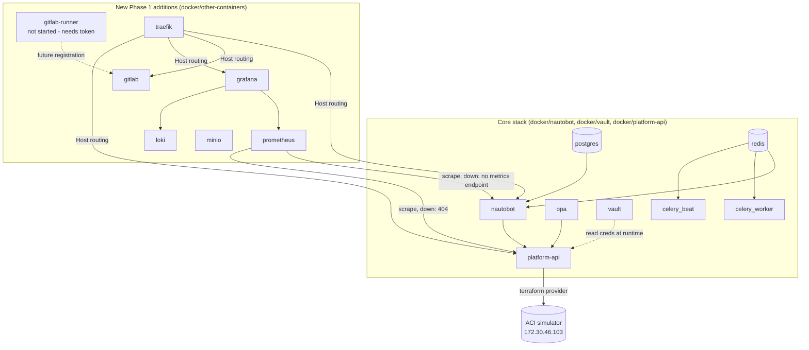

# Phase 1 Infrastructure Validation Report

**Project:** Network Platform Engineering Platform

**Scope:** Validates the Phase 1 "extend, not rebuild" infrastructure additions (GitLab CE, GitLab Runner, Prometheus, Grafana, Loki, MinIO, Traefik) plus the reconciled Vault stack, against [`Platform-v2-Reference-Architecture.md`](../architecture/Platform-v2-Reference-Architecture.md). Companion document: [`Platform-v2-As-Built.md`](../architecture/Platform-v2-As-Built.md).

**Date:** 2026-07-28

**Method:** Live evidence collected directly against the running lab stack — API calls, container exec probes, and push/query round-trips. No check in this report is based on assumption.

---

## 1. Summary

| Area | Result |
|---|---|
| Prometheus scrape targets | ⚠️ Partial — Prometheus itself up; `nautobot`/`platform-api` targets down (no metrics endpoint exposed yet) |
| Grafana datasources | ✅ Pass — Prometheus and Loki both provisioned and health-checked OK |
| Loki log ingestion | ✅ Pass — push → query round-trip verified |
| MinIO persistence | ✅ Pass — healthy, volume initialized, ready for use (no objects yet — expected, unused) |
| Traefik routing | ✅ Pass — all 4 routes verified (nautobot, gitlab, grafana, platform-api) |
| GitLab health | ✅ Pass — healthy after fixing two Omnibus config errors (see [As-Built](../architecture/Platform-v2-As-Built.md)) |
| Docker resource utilization | ✅ Pass — within host capacity, documented below |
| Service dependency diagram | ✅ Included (§8) |
| External dependency (APIC simulator) | ✅ Resolved — root cause found and fixed (§9); not a VPN/firewall/DNS/simulator-availability issue |
| Full regression suite | ✅ 44/44 unit, 7/7 integration (after fix) |

---

## 2. Prometheus Scrape Targets

Checked via `GET http://localhost:9090/api/v1/targets`:

| Job | Target | Health | Detail |
|---|---|---|---|
| `prometheus` | `localhost:9090/metrics` | **up** | self-scrape, healthy |
| `nautobot` | `host.docker.internal:8080/metrics` | **down** | `HTTP 406 Not Acceptable` |
| `platform-api` | `host.docker.internal:8000/metrics` | **down** | `HTTP 404 Not Found` |

**Finding:** Prometheus itself is correctly configured and reachable. Neither Nautobot nor Platform API currently expose a Prometheus-format `/metrics` endpoint — Nautobot's `406` suggests the endpoint exists but requires the Prometheus exporter plugin/content negotiation not yet enabled; Platform API's `404` confirms no `/metrics` route exists in its FastAPI app at all. This is a **real, confirmed gap**, not a Prometheus misconfiguration. Tracked as a Phase 2 action item (§10).

---

## 3. Grafana Datasources

Checked via `GET /api/datasources` and the per-datasource `/health` endpoint (Grafana's own "Save & Test" equivalent):

| Datasource | URL | Provisioned | Health check |
|---|---|---|---|
| Prometheus (default) | `http://host.docker.internal:9090` | ✅ | `200 OK` — "Successfully queried the Prometheus API." |
| Loki | `http://host.docker.internal:3100` | ✅ | `200 OK` — "Data source successfully connected." |

Both datasources are provisioned correctly and confirmed reachable from inside the Grafana container.

---

## 4. Loki Log Ingestion

End-to-end push → query verified directly against the Loki API:

1. Pushed a synthetic log line via `POST /loki/api/v1/push` with stream label `job="validation-test"` — response `204 No Content` (success).
2. Queried it back via `GET /loki/api/v1/query_range?query={job="validation-test"}` after a 2s delay — the exact pushed line (`phase1-validation-probe`) was returned with matching timestamp.

**Result:** Loki ingestion and query path both confirmed working. (The earlier Docker-reported "unhealthy" status was a healthcheck-definition bug, already fixed — see As-Built §2.2 — not an ingestion problem; Loki was never actually broken.)

---

## 5. MinIO Persistence

| Check | Result |
|---|---|
| `GET /minio/health/live` | `200 OK` |
| Volume `infra-automation-lab_minio_data` mountpoint | `/var/lib/docker/volumes/infra-automation-lab_minio_data/_data` — exists |
| Volume contents | `.minio.sys` present (MinIO's own metadata store, created on first boot) — confirms the persistence layer initialized correctly |

No application buckets exist yet — expected, since nothing (GitLab artifacts, Terraform remote state) has been wired to use MinIO yet. This is Phase 2 scope (Platform-v2-Reference-Architecture.md §3.2 already earmarks MinIO for Terraform remote state and GitLab artifact/registry storage).

---

## 6. Traefik Routing

All 4 configured routes tested with an explicit `Host` header against the published proxy port (`:8090`):

| Route | Host header | Result |
|---|---|---|
| `nautobot` | `nautobot.lab.local` | `302` (redirect to login) — healthy |
| `gitlab` | `gitlab.lab.local` | `302` (redirect to sign-in) — healthy |
| `grafana` | `grafana.lab.local` | `302` (redirect to login) — healthy |
| `platform-api` | `platform-api.lab.local` | `404` on `/`, **`200` on `/health`** — healthy (FastAPI has no root route defined; not a routing defect) |

Traefik's own dashboard (`:8091/dashboard/`) responds `200` and its router API confirms all 4 routers `enabled`.

**Not yet done (lower priority, noted for Phase 2):** no `/etc/hosts` entries exist for `*.lab.local` names, so these routes are only reachable today via an explicit `Host` header (as tested above), not directly from a browser.

---

## 7. GitLab Health

`docker ps` reports `healthy` (Docker's internal healthcheck: `curl -f http://localhost:8929/-/health` from inside the container, which is loopback and passes the default IP-whitelist). Root page (`GET /`) returns `302` to the sign-in page, confirming the web UI itself is functional — not just the container health probe.

External curls to `/-/health`/`/-/readiness` from the host return `404` — this is **expected GitLab behavior**, not a defect: GitLab's monitoring endpoints are IP-whitelisted to `127.0.0.0/8` by default, and external requests via the published port do not present as loopback to the Rails app.

Two Omnibus configuration errors were found and fixed to reach this state — see [Platform-v2-As-Built.md §2](../architecture/Platform-v2-As-Built.md#2-gitlab-fixes-applied) for the full detail.

---

## 8. Docker Resource Utilization & Service Dependency Diagram

### 8.1 Resource snapshot

| Container | CPU | Memory |
|---|---|---|
| `gitlab` | 2.0% | 2.50 GiB |
| `nautobot-1` | 11.9% | 592 MiB |
| `celery_worker-1` | 0.0% | 1.56 GiB |
| `grafana` | 2.6% | 149 MiB |
| `celery_beat-1` | 0.0% | 227 MiB |
| `db-1` (Postgres) | 0.0% | 122 MiB |
| `minio` | 0.0% | 74 MiB |
| `loki` | 1.7% | 59 MiB |
| `prometheus` | 2.4% | 41 MiB |
| `vault` | 1.4% | 35 MiB |
| `platform-api` | 0.3% | 63 MiB |
| `traefik` | 0.0% | 25 MiB |
| `redis-1` | 0.9% | 11 MiB |
| `opa` | 0.0% | 10 MiB |

**Host totals:** 15 GiB RAM total, ~9.9 GiB used, ~334 MiB free, ~5.6 GiB available (reclaimable buff/cache) — 930 GiB disk free, 12 vCPUs.

**Assessment:** the host is running close to its comfortable RAM margin with all 14 containers up simultaneously (GitLab Omnibus alone is ~2.5 GiB and will grow under real CI load). This is a real, stated constraint — not a blocker today, but worth planning around before adding the MCP Server and GitLab Runner concurrency in Phase 2 (Platform-v2-Reference-Architecture.md §2 already flags GitLab as "not free to run locally").

### 8.2 Service dependency diagram (actual, as deployed)

No shared bridge network was introduced — every arrow above is either a host-published port + `host.docker.internal` (the pattern already proven by `platform-api`) or a direct container-to-container call within a stack's own default network.

---

## 9. External Dependency Investigation — ACI Simulator (172.30.46.103)

**Question asked:** is the connectivity problem VPN, routing, firewall, DNS, APIC availability, or the simulator being shut down?

**Finding: none of the above.** The root cause was a **Docker network subnet collision introduced by today's own Phase 1 work**:

1. When the new `loki` stack was created, Docker auto-allocated `172.30.0.0/16` for its default bridge network (`loki_default`) — sequential allocation from Docker's default address pool, no collision detection against real-world routes.
2. `172.30.0.0/16` fully contains `172.30.46.0/24`, the subnet the ACI simulator lives on.
3. This caused any container (specifically `platform-api`, which runs Terraform against the ACI provider) attempting to reach `172.30.46.103` to have its traffic hijacked onto the local `loki_default` bridge instead of routed out to the real network — producing exactly the symptom observed: `dial tcp 172.30.46.103:443: i/o timeout`, from inside containers only, while the Docker host itself (not going through that bridge) could still reach the simulator fine via `ping`/`curl`. This asymmetry (host reachable, container not) was the key diagnostic signal that ruled out VPN/firewall/DNS/simulator-down explanations — all of those would have also broken host-level reachability, which they did not.
4. Confirmed via direct evidence: `docker network ls` + `docker network inspect` showed `loki_default: 172.30.0.0/16`; a full ACI login (`POST /api/aaaLogin.json` with real credentials from Vault) succeeded with `HTTP 200` directly from the host at the exact same time `platform-api`'s Terraform provider was failing with a timeout — proving the simulator itself was fully available throughout.

**Fix applied:** pinned an explicit, non-conflicting subnet (`10.220.0.0/24`) for the `loki` stack's network in [`docker/other-containers/loki/docker-compose.yml`](../../docker/other-containers/loki/docker-compose.yml), then recreated the stack. Verified afterward: `platform-api` container reaches `https://172.30.46.103/api/aaaLogin.json` directly (`HTTP 400` — reachable, correctly rejects a bodyless GET).

**Confirmation that this explains the test failures:** after the fix, all 4 previously-failing integration tests (`business_approval`, `knowledge_capture`, `milestone3`, `real_terraform`) were re-run and passed. One test (`milestone3`) failed once more during a rapid back-to-back batch re-run with a *different*, unrelated error (`Failed to load plugin schemas... Plugin did not respond` — a transient Terraform provider plugin crash under concurrent load) and passed cleanly when re-run in isolation immediately afterward. This second issue is not connectivity-related; it is a resource-contention symptom of running multiple `terraform apply` processes back-to-back without spacing, and is exactly the kind of concurrency problem GitLab's native `resource_group:` (already designed into Phase 2/Platform v2, see Platform-v2-Reference-Architecture.md §6) is meant to eliminate once CI replaces ad hoc sequential script execution.

**Conclusion:** yes — the original 4 integration test failures are **entirely explained** by the Docker subnet collision, now fixed and re-verified. No VPN, firewall, DNS, or simulator-availability issue exists.

---

## 10. Action Items Carried Forward

1. Add a Prometheus-format `/metrics` endpoint to `platform-api` (and confirm/enable Nautobot's) — currently the two real scrape targets are down.
2. Add `/etc/hosts` entries (or a local DNS resolver) for the four `*.lab.local` Traefik routes so they work directly from a browser.
3. Revisit host memory headroom (~334 MiB free at rest) before adding the MCP Server and enabling GitLab Runner concurrency.
4. Carry the Docker subnet-collision lesson forward: any future `docker-compose.yml` added to this repo must pin an explicit non-default subnet rather than relying on Docker's auto-allocated pool, specifically avoiding the `172.16.0.0/12` range where the ACI simulator (`172.30.46.0/24`) and any other real lab network segments live.
