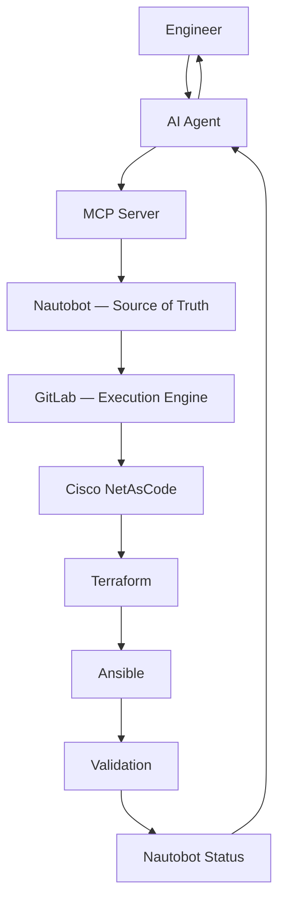
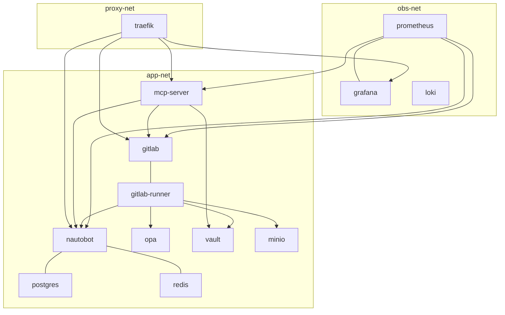
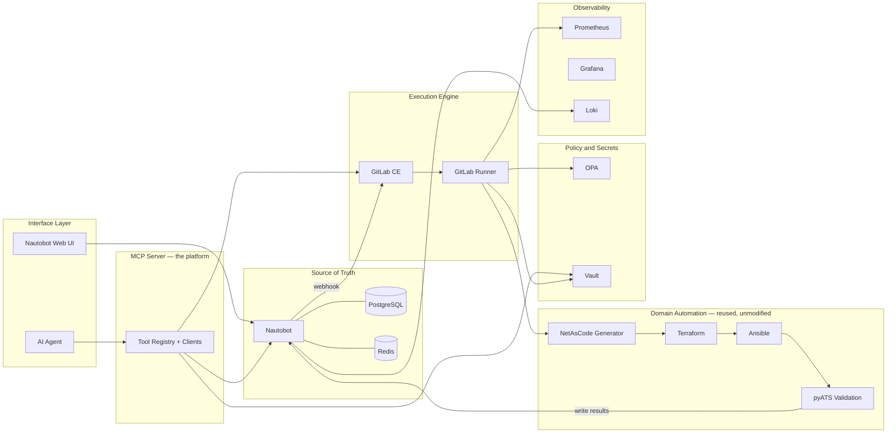
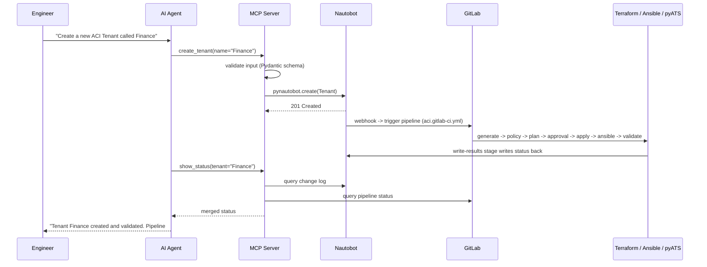

**Project:** Network Platform Engineering Platform

**Document Type:** Reference Architecture (Approved)

**Version:** 2.0

**Status:** Approved — replacement architecture; Phase 1 infrastructure implemented and validated (see [`Platform-v2-As-Built.md`](Platform-v2-As-Built.md) and the [Phase 1 Infrastructure Validation Report](Phase1-Infrastructure-Validation-Report.md)); MCP Server built and live (Execution-Framework.md Milestone 5); the VS Code Copilot Agent is connected as a real MCP client and has completed full business operations end-to-end (Milestone 6, complete). A second domain (Cisco Nexus VXLAN EVPN) has since been built and live-verified against real hardware, proving this architecture's multi-domain design — see [ADR-021](../adr/ADR-021-VXLAN-EVPN-Domain-Expansion.md). Several "future"/`evpn.py`-as-placeholder references below predate that work and describe the design intent that EVPN has since realized — check [`Platform-Status-and-Pending-Items.md`](Platform-Status-and-Pending-Items.md) for what's actually live today.

**Owner:** Platform Engineering Team

**Date:** 2026-07-24

> **Architectural decision:** this document is a **replacement**, not a migration. The Platform API (`main.py`, `execution_store.py`, `approval_workflow.py`, `terraform_executor.py`, `workflow_stub.py`, `validation_stub.py`, `nautobot_store.py`) is now **legacy (Platform v1)**. It is not preserved, ported, or kept compatible. Only the **proven domain automation** (`platform/python/`, `platform/terraform/`, `platform/ansible/`, `tests/pyats/`) survives unchanged, now invoked by GitLab instead of by Python glue code.
>
> **Supersedes:** [`Reference-Architecture-v1.md`](archive/Reference-Architecture-v1.md), [`Platform-Control-Plane-v1.md`](archive/Platform-Control-Plane-v1.md), [`AI-Driven-Platform-Evolution.md`](archive/AI-Driven-Platform-Evolution.md) (which framed this as an evolution — superseded by this document's replacement framing), Contract #2 ([`Contract-2-Platform-API-Specification.md`](archive/Contract-2-Platform-API-Specification.md)) and Contract #3 ([`Contract-3-Platform-Execution-Model-Specification.md`](archive/Contract-3-Platform-Execution-Model-Specification.md)). ADR-004, ADR-005, ADR-006, ADR-015 are retired by this decision. The full file-by-file disposition is the Component Responsibility Matrix already reviewed and approved (session record, not duplicated here).
>
> **Next increment:** scoped as the [Execution Framework](Execution-Framework.md) (ADR-017), not narrowly as "GitLab CI pipeline work" — GitLab CI implements one stage of that framework.

---

# Mandatory Design Principles

## 1. The MCP Server becomes the platform

The MCP Server is the **only** entry point for the VS Code Copilot Agent, Claude Desktop, and future AI assistants. It owns tool registration, input validation, authentication, the Nautobot/GitLab/Vault API wrappers, and deployment status aggregation. **It must never become another orchestration engine** — every tool call either validates-and-writes to Nautobot, or reads from Nautobot/GitLab. It never sequences multi-step workflows itself; that is GitLab's job.

> **Forward-compatibility note ([ADR-019](../adr/ADR-019-Three-Truths-Principle.md)):** the MCP Server's tool registry is deliberately open to future *business-operation tools* (`provision_customer_zone`, `decommission_environment`) that may span multiple domains. When those tools exist, multi-domain coordination is the responsibility of the AI/LangGraph reasoning layer calling MCP tools in sequence — not the MCP Server orchestrating internally. This preserves the "never an orchestration engine" principle while acknowledging that multi-domain, business-intent-level operations will eventually exist.

## 2. Nautobot is the Source of Truth for network inventory and topology

Nautobot owns desired network state — inventory, topology, allocations, lifecycle, and engineering metadata for objects that fit its DCIM/IPAM model. Per [ADR-019](../adr/ADR-019-Three-Truths-Principle.md), this is Truth #2 (Desired State), not Truth #1 (Business Intent). Business intent — *why* a change was requested — is a separate concern, implicit today, owned by the future AI/MCP intent layer when built. Non-network domains whose objects do not fit Nautobot's model may have their own domain-specific SoTs (see ADR-019's domain-adapter boundary rules).

## 3. GitLab becomes the execution engine

GitLab CE + GitLab Runner own execution, approvals, retries, concurrency, resource locking, artifacts, logs, and pipeline history. Custom execution logic is replaced with GitLab-native capabilities wherever a native capability exists.

## 4. The proven domain automation is not redesigned

`platform/python/` (generator, `generate_aci.py`, future `generate_evpn.py`), `platform/terraform/aci/` (future `evpn/`, `fortinet/`, `azure/`), `platform/ansible/aci/` (future `evpn/`, `fortinet/`, `azure/`), `tests/pyats/`, `tests/integration/` — none of these are rewritten. They are only adapted to a new execution environment (GitLab CI jobs instead of Python subprocess calls).

## 5. The Platform API is replaced, not migrated

`main.py`, `execution_store.py`, `approval_workflow.py`, `terraform_executor.py`, `workflow_stub.py` (already deleted in Milestone 6A), `validation_stub.py`, `nautobot_store.py` are legacy. Their responsibilities move to the MCP Server, Nautobot, and GitLab — never preserved as a compatibility shim.

---

# 1. Platform v2 Reference Architecture



This is the exact flow requested: **AI Agent → MCP Server → Nautobot → GitLab → Cisco NetAsCode → Terraform → Ansible → Validation → Nautobot Status → AI Agent**. Every arrow is either a native capability of an existing enterprise-grade tool (Nautobot's webhook, GitLab's pipeline engine) or a thin, already-proven piece of domain automation (the generator, Terraform module, Ansible playbooks, pyATS scripts). No arrow requires new custom orchestration code.

---

# 2. Container Architecture

`docker/` becomes a complete, self-contained platform:

```text
docker/
  nautobot/
  postgres/
  redis/
  gitlab/
  gitlab-runner/
  vault/
  opa/
  mcp-server/
  prometheus/
  grafana/
  loki/
  minio/
  traefik/
  docs/
```

| Service | Dockerfile | Compose | Network | Volumes | Health check | Depends on | Resources (lab-scale) |
|---|---|---|---|---|---|---|---|
| `nautobot` | Upstream image, no custom Dockerfile needed | `docker/nautobot/docker-compose.yml` | `app-net` | `nautobot_media`, config bind mounts | `GET /health/` | postgres, redis | 2 vCPU / 4 GB |
| `postgres` | Upstream `postgres:` image | `docker/postgres/docker-compose.yml` | `app-net` | `postgres_data` | `pg_isready` | — | 1 vCPU / 2 GB |
| `redis` | Upstream `redis:` image | `docker/redis/docker-compose.yml` | `app-net` | `redis_data` | `redis-cli ping` | — | 0.5 vCPU / 512 MB |
| `gitlab` | Upstream Omnibus image | `docker/gitlab/docker-compose.yml` | `app-net`, `proxy-net` | `gitlab_config`, `gitlab_logs`, `gitlab_data` | `/-/health` | — | 4 vCPU / 8 GB |
| `gitlab-runner` | Upstream `gitlab/gitlab-runner:` image | `docker/gitlab-runner/docker-compose.yml` | `app-net` | `gitlab_runner_config`, Docker socket mount (for `docker`-executor jobs) | `gitlab-runner verify` | gitlab | 2 vCPU / 4 GB (scales with concurrent jobs) |
| `vault` | Existing (unchanged) | `docker/vault/docker-compose.yml` | `app-net` | `vault_data` | `vault status` | — | 0.5 vCPU / 512 MB |
| `opa` | Existing (unchanged) | `docker/opa/docker-compose.yml` | `app-net` | policy bind mount (`ro`) | none (image has no shell — already documented) | — | 0.25 vCPU / 256 MB |
| `mcp-server` | New — Python, see §7 | `docker/mcp-server/docker-compose.yml` | `app-net`, `proxy-net` | none required (stateless) | `GET /health` | nautobot, gitlab, vault | 1 vCPU / 1 GB |
| `prometheus` | Upstream image | `docker/prometheus/docker-compose.yml` | `obs-net`, `app-net` (scrape targets) | `prometheus_data` | `/-/healthy` | — | 1 vCPU / 2 GB |
| `grafana` | Upstream image | `docker/grafana/docker-compose.yml` | `obs-net`, `proxy-net` | `grafana_data` | `/api/health` | prometheus, loki | 0.5 vCPU / 1 GB |
| `loki` | Upstream image | `docker/loki/docker-compose.yml` | `obs-net` | `loki_data` | `/ready` | — | 0.5 vCPU / 1 GB |
| `minio` | Upstream image | `docker/minio/docker-compose.yml` | `app-net` | `minio_data` | `/minio/health/live` | — | 0.5 vCPU / 1 GB |
| `traefik` | Upstream image | `docker/traefik/docker-compose.yml` | `proxy-net` | `traefik_acme` (if TLS) | `/ping` | — | 0.25 vCPU / 256 MB |
| `docs` | Optional — MkDocs over `docs/` | `docker/docs/docker-compose.yml` | `proxy-net` | none | — | — | 0.25 vCPU / 256 MB |

**Total lab footprint:** approximately 14 vCPU / 26 GB RAM at minimum concurrency — GitLab Omnibus remains the dominant cost, stated plainly rather than hidden.

**Startup dependencies:** `postgres`/`redis` → `nautobot` → `gitlab` → `gitlab-runner` (registers against `gitlab`) → `mcp-server` (needs `nautobot` and `gitlab` reachable). `vault`/`opa` are independent, only needed once a pipeline runs. Observability (`prometheus`/`grafana`/`loki`) and `minio`/`traefik` are fully independent and can start at any point.

---

# 3. Docker Networking Diagram



One bridge network (`app-net`) for the core platform and its runners, a separate `obs-net` for observability (Prometheus joins both to scrape `app-net` targets), and `proxy-net` fronting the human-facing UIs (Nautobot, GitLab, Grafana) and the MCP Server's health/metrics surface through Traefik.

---

# 4. Component Diagram



---

# 5. Sequence Diagram



---

# 6. GitLab Pipeline Architecture

Reusable pipeline design — one set of shared stage templates, included by each domain's pipeline file, so a new domain never requires new pipeline *logic*, only new domain variables.

```text
.gitlab-ci.yml                       # root: includes the right domain pipeline by CI/CD variable or path rule
pipelines/
  includes/
    common.gitlab-ci.yml             # shared stage templates (generate/policy/plan/approval/apply/ansible/validate/write-results/knowledge/artifacts)
  aci.gitlab-ci.yml                  # includes common.yml, sets TERRAFORM_DIR=platform/terraform/aci, ANSIBLE_DIR=platform/ansible/aci, GENERATOR=generate_aci.py
  evpn.gitlab-ci.yml                 # future — same shape, different variables
  fortinet.gitlab-ci.yml             # future
  azure.gitlab-ci.yml                # future
```

**Shared stages** (`common.gitlab-ci.yml`), each a template job the domain pipeline extends:

| Stage | What it does | GitLab-native capability used |
|---|---|---|
| Generate | Runs the domain's generator (e.g. `generate_aci.py`) against Nautobot, produces the NetAsCode YAML | `artifacts:` publishes the YAML |
| Policy | Calls OPA with the same Rego policies already proven (`policy/cisco_aci/tenant_naming.rego`) | job fails the pipeline on denial — no separate audit path needed, the job log **is** the record |
| Terraform Plan | `terraform init/plan -lock-timeout=60s` against the domain's unmodified Terraform module | `resource_group:` serializes plans/applies per domain+environment |
| Approval | Manual job on a **protected environment** requiring approvers | Native GitLab protected environments — replaces ADR-015 entirely |
| Terraform Apply | `terraform apply -auto-approve -lock-timeout=60s` | `resource_group:`, `retry:`, `artifacts:` (tfplan/tf output) |
| Ansible | Runs the domain's Day-2 playbooks (e.g. `platform/ansible/aci/playbooks/day2-epg.yml`) unmodified | — |
| Validation | Runs the domain's pyATS job (e.g. `tests/pyats/aci/job.py`) unmodified | `artifacts:` publishes the pyATS report |
| Write Results | Writes pipeline outcome back to Nautobot (custom field/tag on the object) via a small script using `pynautobot` | — |
| Knowledge Capture | Appends one JSONL record (intent, Git commit, pipeline ID, terraform output, validation result, artifacts, execution time, operator, agent) via the reused `jsonl_writer.py` | `artifacts:` for the record itself if desired |
| Artifact Publishing | Publishes YAML/tfplan/tf output/pyATS report as GitLab CI artifacts (or to MinIO for larger objects / remote Terraform state) | Native `artifacts:` or MinIO S3 API |

**Trigger:** Nautobot's native Webhook (Jinja2 body template) POSTs directly to GitLab's `POST /projects/:id/trigger/pipeline` — no listener service. **Retries:** native `retry:` per job. **Rollback:** re-running the pipeline against a prior Git-committed YAML revision — Terraform's own idempotent apply handles convergence, no custom rollback machinery.

---

# 7. MCP Server Architecture

Designed as a production-ready application, not a prototype.

## 7.1 Package layout

```text
mcp-server/
  pyproject.toml
  requirements.txt
  Dockerfile
  src/
    mcp_server/
      __init__.py
      main.py                # MCP protocol entrypoint + health endpoint bootstrap
      config.py               # Pydantic Settings — env-based configuration
      logging.py                # structured JSON logging setup
      auth.py                     # AI-client-facing authentication (API key / OAuth2 client-credentials)
      errors.py                     # exception hierarchy -> MCP error response mapping
      clients/
        __init__.py
        nautobot.py            # pynautobot wrapper
        gitlab.py                 # python-gitlab wrapper
        vault.py                     # Vault client (reuses the read pattern proven in generate_aci.py / terraform_executor.py)
        opa.py                         # reuses TechnicalPolicyClient's call shape from Platform v1
      tools/
        __init__.py
        registry.py             # tool registration/dispatch — domain-agnostic, routes by tool name only
        generic.py                 # deploy, approve_change, deny_change, show_status, query_knowledge
        aci.py                       # create_tenant, create_vrf, create_bridge_domain, create_epg, create_contract, create_l3out
        evpn.py                        # future
        fortinet.py                      # future
        azure.py                           # future
      schemas/
        __init__.py
        common.py                # shared Pydantic conventions only (field-level helpers) -- NOT a cross-domain intent envelope; see ADR-018
        aci.py                       # ACI-specific per-tool request schemas (thin argument validation only -- create_tenant, create_vrf, etc.)
  tests/
    unit/
    integration/
```

## 7.2 Tool registry

A decorator-based registry (`@registry.register(name="create_tenant", domain="cisco_aci", schema=CreateTenantRequest)`) that:

* Builds the **tool catalogue** the MCP protocol advertises to AI clients (name, domain, description, input schema) automatically from registered tools.
* Dispatches an incoming tool call to its handler by name only — the dispatcher itself contains no domain logic and never branches on domain.
* Enforces domain isolation structurally: `tools/generic.py` must not import from `tools/aci.py`/`tools/evpn.py`/etc.; `tools/registry.py` must not import any vendor-specific module. This is the exact same boundary discipline already proven in Platform v1 (`aci_materializer.py`/`_aci_tenant_name()` never leaking into `nautobot_store.py`/`execution_store.py`), relocated here.

## 7.3 Authentication

Two distinct auth boundaries, never conflated:

* **AI client → MCP Server:** API key or OAuth2 client-credentials, configured per client (Copilot Agent, Claude Desktop).
* **MCP Server → Nautobot/GitLab/Vault:** the MCP Server holds its own service-account credentials, sourced from Vault at startup. The AI agent never sees or receives these — consistent with ADR-010's "AI never receives privileged or direct access to execution engines."

## 7.4 Configuration

Environment-based (`NAUTOBOT_URL`, `NAUTOBOT_TOKEN`, `GITLAB_URL`, `GITLAB_TOKEN`, `VAULT_ADDR`, `VAULT_TOKEN`, `OPA_URL`, `MCP_API_KEY`, `LOG_LEVEL`) — the same convention Platform v1 already established (`NAUTOBOT_TOKEN`/`VAULT_TOKEN` required, fail-fast), reused as a pattern, not as code.

## 7.5 Logging and error handling

Structured JSON logs per tool call (tool name, request ID, domain, duration, outcome) shipped to Loki. A small exception hierarchy (`ValidationError`, `NautobotError`, `GitLabError`, `VaultError`, `PolicyDeniedError`) maps to specific MCP error responses — no raw stack traces ever reach the AI agent.

## 7.6 Health endpoint

`GET /health` checks Nautobot/GitLab/Vault reachability — the same "reachable, not necessarily authorized" pattern Platform v1's `/readiness` endpoint already proved out.

## 7.7 Status aggregation

`show_status` merges Nautobot's Change Log with GitLab's pipeline status — the one piece of genuinely new logic the MCP Server owns (per the Platform Boundary Review already conducted).

## 7.8 Tool catalogue

Per [ADR-018](../adr/ADR-018-NetAsCode-Centric-Execution-Framework.md), every tool below writes structured objects directly to Nautobot -- there is no shared intent envelope. NetAsCode YAML, generated from Nautobot by the domain generator, is the authoritative intent artifact that the Execution Framework's later stages consume; the MCP Server's job ends at the Nautobot write plus triggering/monitoring the pipeline.

**Generic** (never imports vendor-specific code): `deploy`, `approve_change`, `deny_change`, `show_status`, `query_knowledge`.

**Cisco ACI** (`tools/aci.py`): `create_tenant`, `create_vrf`, `create_bridge_domain`, `create_epg`, `create_contract`, `create_l3out`.

**Future domains**, added the same way, never touching generic modules: `tools/evpn.py` (`create_fabric`, `create_vni`, `allocate_loopback`), `tools/fortinet.py`, `tools/azure.py`.

---

# 8. Deployment Flow

Explicit, matching the requested flow exactly:

```text
AI Agent
    |
    v
MCP Server           (validates input, never orchestrates)
    |
    v
Nautobot             (Source of Truth — the write lands here)
    |
    v
GitLab               (webhook-triggered — the execution engine)
    |
    v
Cisco NetAsCode      (generator — reused unchanged)
    |
    v
Terraform            (reused unchanged)
    |
    v
Ansible              (reused unchanged)
    |
    v
Validation           (pyATS — reused unchanged)
    |
    v
Nautobot Status      (write-results stage)
    |
    v
AI Agent             (via show_status / query_knowledge)
```

---

# 9. Repository Structure

```text
docker/
  nautobot/
  postgres/
  redis/
  gitlab/
  gitlab-runner/
  vault/
  opa/
  mcp-server/
  prometheus/
  grafana/
  loki/
  minio/
  traefik/
  docs/
mcp-server/                          # MCP Server source (see Section 7.1)
platform/
  python/
    generate_aci.py                   # unchanged
    generator/                          # unchanged
    generate_evpn.py                     # future
  terraform/
    aci/                                # unchanged
    evpn/                                 # future
    fortinet/                              # future
    azure/                                   # future
  ansible/
    aci/                                # unchanged
    evpn/                                 # future
    fortinet/                              # future
    azure/                                   # future
  netascode/                          # unchanged, generated artifact output
pipelines/
  includes/
    common.gitlab-ci.yml
  aci.gitlab-ci.yml
  evpn.gitlab-ci.yml                  # future
  fortinet.gitlab-ci.yml               # future
  azure.gitlab-ci.yml                    # future
.gitlab-ci.yml
tests/
  pyats/                              # unchanged
  integration/                        # adapted trigger mechanism, assertions preserved
  unit/                               # split between mcp-server/tests and domain-automation tests
docs/                                 # this document set
```

---

# 10. Migration Strategy — Platform v1 to Platform v2 (Replacement, Not Migration)

Because this is a replacement, the strategy is: **stand up v2 fully in parallel, prove it end-to-end against real infrastructure, then decommission v1 outright** — not a gradual code-sharing migration.

**Phase 1 — Infrastructure.** Stand up `docker/gitlab/`, `docker/gitlab-runner/`, `docker/mcp-server/` (skeleton only), `docker/prometheus/`, `docker/grafana/`, `docker/loki/`, `docker/minio/`, `docker/traefik/` alongside the untouched v1 stack. Zero risk — v1's 44 unit + 7 integration tests remain entirely unaffected.

**Phase 2 — Domain automation onto GitLab.** Write `pipelines/includes/common.gitlab-ci.yml` and `pipelines/aci.gitlab-ci.yml`, calling `platform/terraform/aci/`, `platform/ansible/aci/`, `tests/pyats/aci/`, and `platform/python/generate_aci.py` **unmodified**. Validate by manually triggering the pipeline and independently confirming the same live-APIC result `real_terraform_smoke_test.py` already proves.

**Phase 3 — MCP Server.** Build the full package from §7, starting with `create_tenant`/`create_vrf` only. Wire Nautobot's webhook to the Phase 2 pipeline. Validate the complete AI-to-Nautobot-to-GitLab-to-live-APIC loop for one object type.

**Phase 4 — Full tool catalogue and AI client cutover.** Add the remaining generic and ACI tools. Point VS Code Copilot Agent / Claude Desktop at the MCP Server exclusively.

**Phase 5 — Decommission Platform v1 outright. ✅ Complete (2026-07-30).** `docker/platform-api/app/` (`main.py`, `execution_store.py`, `approval_workflow.py`, `terraform_executor.py`, `validation_stub.py`, `nautobot_store.py`, `aci_materializer.py`, and the already-dead `terraform_stub.py`), `platform/canonical_intent/`, and their 7 unit test files were archived to [`archive/platform-v1/`](../../archive/platform-v1/README.md) (via `git mv`, not deleted, per this repo's archive-not-delete convention) once the MCP Server + Execution Framework had fully superseded them and nothing in the current architecture still referenced them. `docker/platform-api/policy/` (the OPA policies) stayed in place -- still actively used by the Execution Framework's Policy stage. No compatibility shim was built -- this was the explicit replacement, not a bridge.

**Future domains (EVPN, Fortinet, Azure):** proven additive under this same structure — a new generator, a new Terraform module, a new Ansible tree, a new pipeline file including the same shared stage templates, and new MCP tools in their own module. No change to the MCP Server's dispatcher, the GitLab shared stage templates, or Nautobot's core setup is required.
